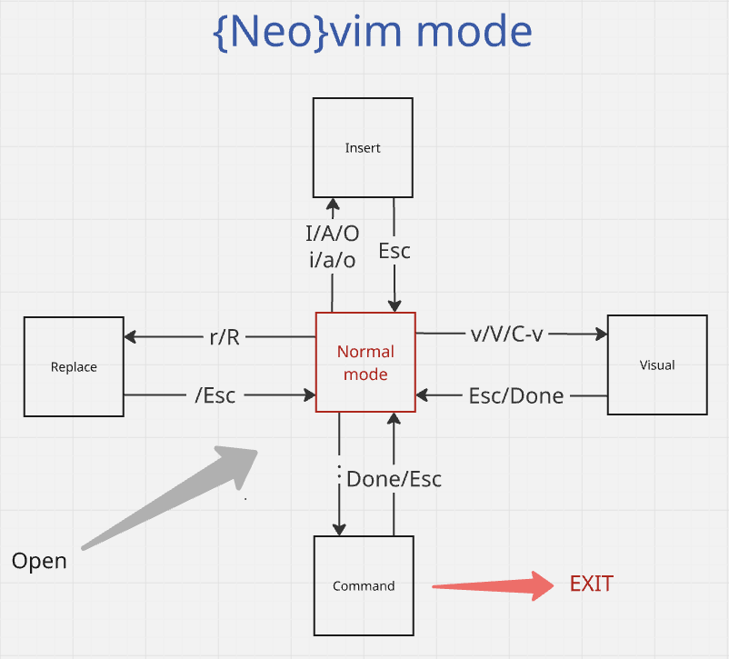

# 为雄心勃勃的开发者打造的LazyVim教程

[原文地址](https://lazyvim-ambitious-devs.phillips.codes/course/chapter-1/)
Author: Dusty Phillips
Translate: DNG
Date: 2025-05-04

---

## 0. Base

[!Danger]所有工具包括IDE, 最终不可避免的走向复杂. 功能越强大, 学习曲线越陡峭.
选择适合自己的工具, 持续深入了解并长期使用, 远比频繁切换工具来得更有效率, 也更具生产力.

> 没有肉车, 只有肉人!   -- 俗语

模式编辑是一种文本编辑范式: 键盘敲击的含义取决于编辑器当前所处的"模式", 常见的模式包括:

- Normal mode
- Insert mode
- Visual mode
  - `v`: 字符级选择
  - `V`: 行级选择
  - `C-v`: 块级选择
  
- Replace mode
  - `r`: 逐字替换, 留在Normal mode
  - `R`: 长期替换, 直到`<Esc>`退回Normal mode
- Command mode


LazyVim 是一种思维模式；它始于对构成现代开发最佳插件配置的共识，以及一个使它们协同工作的配置（管理编辑器配置时，让不同插件的快捷键不相互冲突是主要痛点之一）。

安装:

1. Neovim: `brew install neovim`
2. [官网安装引导](https://www.lazyvim.org/installation)
3. 建议遵循官网的建议, 用起来会更舒服一点
   - fzf: 一个通用的命令行模糊查找器，非常快，可以用来交互式地搜索文件、历史记录、Git 提交等。
   - lazygit: 一个基于终端的 Git 图形化界面，可以让你更直观地执行常见的 Git 操作。 
   - ripgrep (rg): 一个非常快速的文本内容搜索工具，类似于 grep 但通常更快，并且默认会尊重.gitignore 文件。
   - fd: 一个简单、快速且用户友好的 find 命令替代品，用于查找文件和目录。

[!Tip]先理清一个概念:
Lazy.nvim严格来说是一个插件管理器, 而LazyVim是一个打包在一起的插件和配置的集合; 其中一个插件就是Lazy.nvim.

Lazy.nvim最闪耀的功能: 仅在需要的时候才加载插件(因此得名"Lazy"), 所以启动速度快如闪电.
两种进入方式:

1. 在Dashboard页面: `l`
2. 编辑页面: `<Space>l`
3. `q`退出浮动窗口 -- 所有的浮动窗口都是这样退出
   最频繁的操作: `S`--用于安装/清理/更新

## 1. 模式编辑详解

LazyVim新增了几个模式: (注意不是neovim的内建模式)

1. Space mode
2. Z mode: 光标定位/代码折叠/随机命令
3. G mode: Go to 相关
4. D/C/Y mode: 动作相关
   在Normal模式下分别点击上述几键之一, 会弹出菜单指引你进行下一步操作(Which-key.nvim提供支持)

> [!Tip]模式编辑的核心含义: 特定按键的行为取决于当前模式
> 缓冲区(Buffer): 在Vim/Neovim中指内存里文件内容的副本, 由你决定是否写入硬盘.

几个以前没注意(没记住)的知识点:

- 光标在普通模式下是方块, 插入模式下为竖线
- 由普通模式进入插入模式:
  - `i`在光标前插入, `I`在行首插入
  - `a`在光标后插入, `A`在行尾插入
- `gi`: 转到你上次进入插入模式的地方, 并再次进入插入模式
- `gv`: 同理 -- G mode

> [!Tip] Vim设计范式:
> 快捷键小写: "做某事", 大写: "做同样的事, 但范围更大; 或做相反的事."

## 2. 移动/导航/操作

### 2.1 Seek mode

flash.nvim是LazyVim自带的一个插件, 它提供了一种导航模式: Seek Mode
设计思路以及使用方式:
眼睛看到目标`s`进入Seek模式--点击目标字符, 字符后面分配一个临时短标签--点击标签--Boom!
三次点击起步就可以导航到目标区域, 一般不超过四次即可达成目标.
**注意:** 如果可见范围内同字符太多, 目标区域没分配到标签, 就继续输入后面的字符, 缩小匹配范围
优点: 3~4次击键达成目标
缺点: 仅限目视范围内

{Neo}vim中内建的搜索+定位: `/`, 更适合全文导航

### 2.2 Z模式

如果你一定要使用Seek Mode, 那么Z模式这的:

- `zt`: 光标到顶(top)
- `zb`: 光标到底(bottom)
- `zz`: 光标到屏幕中间
  然后再Seek

注意: 并非绝对的top & bottom, 上下还有几行
效果一般

### 2.3 count

相对行号的设置, 使得当前行显示绝对值, 其他行显示偏移量. 使得`<num>j/k`直接"瞪眼秒", 棒!

{Neo}vim中内建的短距离定位导航: `web/WEB`法

### 2.4 实际操作

语法规则: `{num}verb{num}motion|preposition`

1. verb: `d/c/y`
2. motion: `w/e/b/^/0/$...`
3. preposition: `i/a`
4. 尽管num在前后大部分情况等效, 但推荐在前

实例:

- `3dW`
- `ya{`
- `ci"`
- `d$` == `D`
- `c$` == `C`
- `y$` == `y`

去掉`verb`就是导航.

理解规则, 知道动作, 自由组合, 心到手到, 可达化境!

VI系的心智模型: 确定好动作及重复次数然后划定作用范围, 而一般的编辑器正好相反;
如果一定要坚持传统, 那么先使用Visual模式划定再操作也可以, 不过是麻烦了一些; 在某些场合适用.

几个重要的操作:
- `x`: 删除单个字符, 可配合数字键, 大写反向
- `~`: 单个字符大小写切换, 可配合数字
- 花括号: 前后跳跃到空行, 代码全局统揽很棒!

### 2.5 宏

录制宏基本流程:
1. `q`加上寄存器名称(小写字母, 如: a)
2. 执行想要录制的一系列命令
3. `q`停止录制
4. 回放宏: `@a`--就是@后面跟上录制的名称
5. 重放上一次回放的宏: `@@`

## 3. 打开文件

### 3.1 文件选择器

LazyVim自带snacks.nvim插件包含了一系列现代化的, 提升生活质量的改进. 它集成了一个高性能的选择器(Picker):

- 选择器 (Picker): 一种UI组件(弹出窗口), 通过输入模糊搜索, 快速过滤并选择列表当中的项目
- 模糊搜索 (Fuzzy Search/Finding): 一种搜索技术，允许匹配不完全精确的字符串

快捷键: `<Space><Space>`
- 光标自动聚焦于左上角, 并进入插入状态, 输入部分文件名(可间隔跳跃)
- 被选中的文件在右侧窗口预览, 回车打开
- 默认大小写不敏感, 但如果在任意顺序你输入了大写字母, 马上编程大小写敏感, 称为: Smart case.
- 左侧文件窗口滚动: `<C-u/d>`
- 右侧预览窗口滚动: `<C-f/b>`
- 如果放弃本次打开窗口: `<Esc><Esc>`, 关闭选择器

功能强悍!

两个目录的区别:
- Root: 项目根目录(标记为.git或其他, 有些编程语言不准)
- cwd: Current Working Directory当前工作目录, 一般为从哪个目录打开的nvim, 以`:pwd`的显示为准
  - 可`:cd`改变

部分情况下这两个目录相同
操作时, 按下空格键后参考弹出菜单了解详情
这就是应用面最广的`<Space>模式`

### 3.2 Mini.files替代Sankes Explorer

因为Explorer插件模式不符合{Neo}vim设计思想模型, 推荐使用mini.files替代.
同时也学习如何替代默认插件
Mini.files 提供了一种叫做“米勒列”(Miller Columns) 的文件浏览界面，常见于 MacOS Finder.

#### 安装
- `:LazyExtras`进入
- 将光标移动到包含"mini.files"的那一行(可`/`快速搜索定位)
- 按`x`安装该插件, 稍等片刻让插件安装完成
- 重启LazyVim
- 卸载重复上述步骤即可

#### 使用
默认快捷键: `<Space>fm`和`<Space>fM`显示"cwd/root"
操作与vim的Normal模式非常相似

不同的地方:
- 文件(不是目录)上`l`在视图下方打开文件, 此时视图并不关闭, 这意味着可一次打开多个文件
- `q`退出视图
- 要重命名文件或文件夹，导航到包含它的行，然后进入插入模式更改或添加文本。
- 删除文件或文件夹使用 dd 命令，这是在普通 Neovim 窗口中删除整行文本的快捷键。
- 使用 yy 复制文件或文件夹，这是复制（“yank”）一行文本的命令。
- 使用 p 放置/粘贴已删除或 yanked 的文件。
- 你使用这些快捷键所做的任何修改，在你输入 = 键之前，实际上都不会保存在文件系统上。= 是一个（罕见的）mini.files 特定快捷键。我把它理解为意为“使文件系统等于我输入的内容”。

现在是mini.files和explorer共存, 下章讲解如何禁用默认, 并将快捷键赋值给mini.files

## 4. 配置与插件基础

### 4.1 LazyVim中插件的三种类别

1. 内置预装, 如: snacks.nvim的选择器Picker和explorer/flash.nvim等
2. LazyExtras: 这些插件默认未启用, 只需要简单几步就可安装好
3. 第三方插件: 需要从头开始配置, 并管理不能与现存插件冲突

第一类占主流, 辅以第二类, 第三类要当心.
仅建议安装第二类这的推荐插件, 其余不推荐.

### 4.2 禁用内置插件

```lua
-- ~/.config/nvim/lua/plugins/disabled.lua
return {
  { "akinsho/bufferline.nvim", enabled = false },
  -- { "插件作者/插件仓库名", enabled = false },
}
```

### 5.3 修改快捷键

定义快捷键的三个地方:
1. `~/.config/nvim/lua/config/keymap.lua`
2. 在传递给插件的Lua表的keys字段中, 映射全局普通模式快捷键
3. 在传递给插件配置的opts参数中, 适用于插件打开或激活时应用

mini.files举例:
```lua
-- ~/.config/nvim/lua/plugins/extend-mini-files.lua
return {
  "echasnovski/mini.files",
  keys = {
    {
      "<leader>e",
      function()
        require("mini.files").open(vim.api.nvim_buf_get_name(0), true)
      end,
      desc = "打开mini.files(当前目录)"
    },
    {
      "<leader>E",
      function()
        require("mini.files").open(vim.uv.cwd(), true)
      end,
      desc = "打开mini.files(Cwd)"
    },
    {
      "<leader>fm",
      function()
        require("mini.files").open(LazyVim.root(), true)
      end,
      desc = "打开mini.files(Root)"
    },
  },
}
```

> 代码参考来源: lazyvim官网--Snacks.nvim配置

## 6 代码折叠

- zc: 关闭光标下的折叠
- zC: 关闭光标下所有的嵌套折叠
- zo: 打开光标下的折叠
- zO: 打开光标下所有的嵌套折叠
- za: 切换光标下折叠的打开/关闭状态
- zR: 打开所有的折叠

还有很多可以点击`z`之后慢慢研究, 日常记住以上几个即可

<mark>书里还有很多后续内容, 作为一个非专业程序员, 了解这些已经足够了, 若有新需求再回头查看就是了. 最后提醒一句: LazyVim自带的模式没事的时候敲进入随便看看.</mark>
END: 2025-05-05
