# 数据可视化笔记

[matplotlib官网](http://matplotlib.org/)
Date: 2023-12-21

---

## 15 生成数据

数据可视化指的是通过可视化表示来探索数据, 它与数据挖掘紧密相关, 而数据挖掘指的是使用代码来探索数据集的规律和关联.
漂亮的呈现数据图片不是重点, 重点是让观看者能够明白其含义, 发现数据集中原本未意识到的规律和意义.

最流行的工具之一是matplotlib, 它是一个数学绘图库, 我们将使用它来制作各种折线图, 散点图等等.

### 15.1 安装

```bash
# MacOS:
pip install [--user] matplotlib

# Arch linux:
sudo pacman -S python3-matplotlib

# 测试安装成功
$ python3
>>> import matplotlib
>>>
```

### 15.2 绘制简单的折线图/散点图

迫不及待的第一个实例代码:

```python
# 导入模块pyplot, 指定别名plt, 以免反复输入pyplot
import matplotlib.pyplot as plt

# 创建一个自然数的平方列表
squares = [1, 4, 9, 16, 25, 36, 49]

# 将列表传递给函数plot()
plt.plot(squares)
# show()函数打开matplotlib查看器,并显示绘制的图形
plt.show()
```

[代码实例](mpl_squares_01.py)

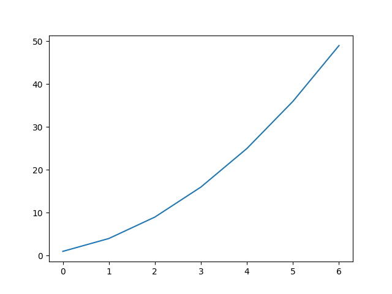

继续美化输出图形: 

```python
import matplotlib.pyplot as plt

squares = [1, 4, 9, 16, 25, 36, 49]
# 参数linewidth决定了 plot()绘制线条的粗细
plt.plot(squares, linewidth=5)

# 设置图表标题, 坐标轴加上标签, fontsize指定文字大小
plt.title("Squares Numbers", fontsize=24)
plt.xlabel("Value", fontsize=14)
plt.ylabel("Squares of Value", fontsize=14)

# 设置刻度标记的大小
plt.tick_params(axis='both', labelsize=14)  # 失误写成lablesize, 结果浪费好几个小时:(
plt.show()
```

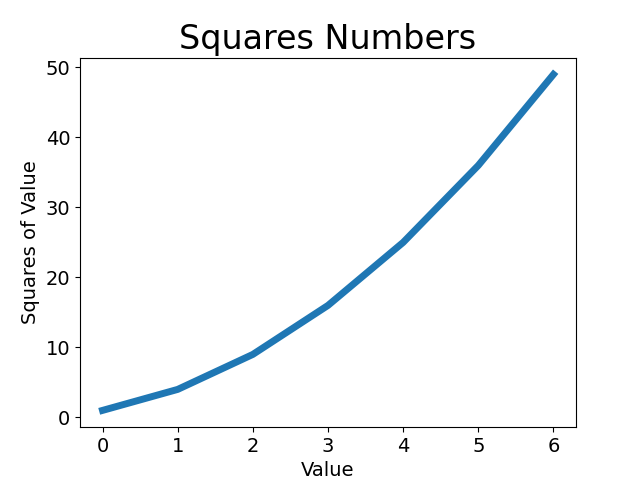

虽然比第一次美观了不少, 信息量也增加了, 但仔细观察, 发现数值对不上, 需要校正

[最终代码](mpl_squares_03.py)

```python
import matplotlib.pyplot as plt

values = [1, 2, 3, 4, 5, 6, 7]
squares = [1, 4, 9, 16, 25, 36, 49]
# 清晰的给出 x 与 y 轴数据即可
plt.plot(values, squares, linewidth=5)

plt.title("Squares Numbers", fontsize=24)
plt.xlabel("Value", fontsize=14)
plt.ylabel("Squares of Value", fontsize=14)

plt.tick_params(axis='both', labelsize=14)
plt.show()
```


#### 使用scatter()绘制散点图

scatter中文翻译为分散或离散, 作为函数可以绘制若干点, 点密集到某种程度就是线了.

先看个最简单, 没干扰因素的

```python
import matplotlib.pyplot as plt

plt.scatter(2, 4)
plt.show()
```

在坐标系中绘制一个点, 完事.

下面实际绘制一个实际的二次散点图

```python
import matplotlib.pyplot as plt

xValues = range(1,1001)
yValues = [x ** 2 for x in xValues]   # 记住这个写法
plt.scatter(xValues, yValues, s=2)

plt.title("Squares Numbers", fontsize=24)
plt.xlabel("Value", fontsize=14)
plt.ylabel("Squares of Value", fontsize=14)

# 设置坐标轴取值范围
plt.axis([0, 1100, 0, 1100000])
plt.show()
```

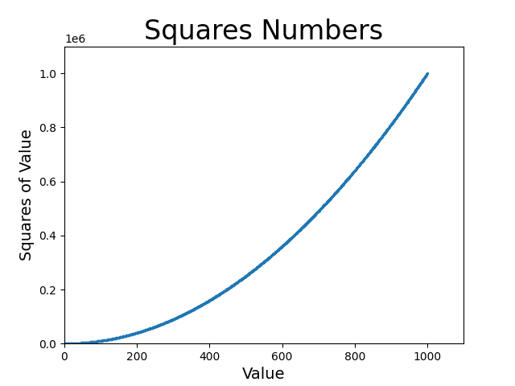

#### 颜色相关

默认为蓝色点和黑色轮廓, 数据点很多时黑色轮廓可能会粘连在一起, 需要删除轮廓
`plt.scatter(xValues, yValues, edgecolor='none', s=2)`

修改数据点颜色:
`plt.scatter(xValues, yValues, c='red', edgecolor='none', s=2)`

个性化色彩:
`plt.scatter(xValues, yValues, c=(0, 0, 0.8), edgecolor='none', s=2)`

颜色映射/colormap是一系列颜色, 它们从起始颜色渐变到结束颜色. 在可视化中, 颜色映射用于突出数据的规律.
`plt.scatter(xValues, yValues, c=yValues, cmap=plt.cm.Blues, edgecolor='none', s=2)`
自动保存图表: plt.show() 替换为 plt.savefig()
`plt.savefig('image/scatterColor.png', bbox_inches='tight')`
第一个参数保存到程序当前目录下/文件名, 第二个参数将图表多余的空白部分裁剪掉, 可省略.

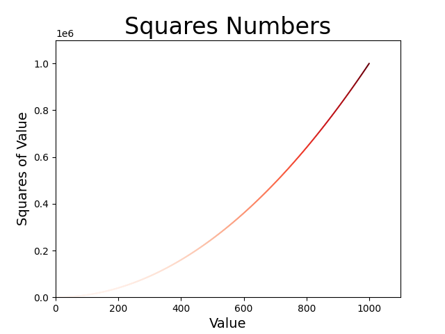

### 15.3 随机漫步

随机漫步: 每次行走都完全是随机的, 没有明确的方向, 结果是由一系列随机决策决定的.
在自然界,物理学,生物学,化学和经济领域, 随机漫步都有其实际用途.

完整代码:

```python
import matplotlib.pyplot as plt
from random import choice   # 每次决策都使用choice()


class RandomWalk():
    """一个生成随机漫步数据的类"""

    def __init__(self, numpoints=5000):   # 漫步次数 5000
        """初始化随机漫步的属性"""
        self.numpoints = numpoints
        # 随机漫步起始点
        self.x_values = [0]
        self.y_values = [0]

    def fillWalk(self):
        """计算随机漫步包含的所有点"""

        # 不断漫步, 直到列表达到指定的长度
        while len(self.x_values) < self.numpoints:
            x_direction = choice([1, -1])
            x_distance = choice([0, 1, 2, 3, 4])
            x_step = x_direction * x_distance

            y_direction = choice([1, -1])
            y_distance = choice([0, 1, 2, 3, 4])
            y_step = y_direction * y_distance

            # 拒绝原地踏步
            if x_step == 0 and y_step == 0:
                continue

            # 计算下一个点的坐标
            next_x = self.x_values[-1] + x_step
            next_y = self.y_values[-1] + y_step

            self.x_values.append(next_x)
            self.y_values.append(next_y)


rw = RandomWalk()
rw.fillWalk()
plt.scatter(rw.x_values, rw.y_values, s=2)
plt.show()
```

工作正常之后进行拆分:

[完整代码](randWalk.py), [类文件](randWalkClass.py), [主程序](randWalkMain.py)
注意头部导入文件的不同和背后的原因
成品图:

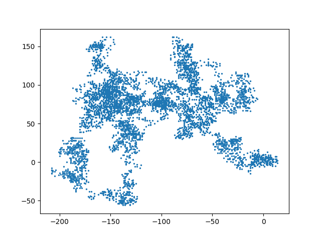

#### 设置随机漫步图的样式

突出显示起点,终点和经过的路径

```python
# 继续沿用上一个例子中的类文件

import matplotlib.pyplot as plt

from randWalkClass import RandomWalk

# 只要程序处于活动状态, 就不断地模拟随机漫步
while True:
    # 创建一个 RandomWalk 实例, 并将其包含的点都绘制出来
    rw = RandomWalk()
    rw.fillWalk()

    pointnumbers = list(range(rw.numpoints))
    plt.scatter(rw.x_values, rw.y_values, c=pointnumbers, cmap=plt.cm.Blues, edgecolor='none', s=5)
    plt.show()

    # 突出显示起点和终点
    plt.scatter(0, 0, c='green', edgecolor='none', s=50)
    plt.scatter(rw.x_values[-1], rw.y_values[-1], c='red', edgecolor='none', s=50)

    keepRuning = input("Make another walk? (y/n): ")
    if keepRuning == 'n'
      break
```

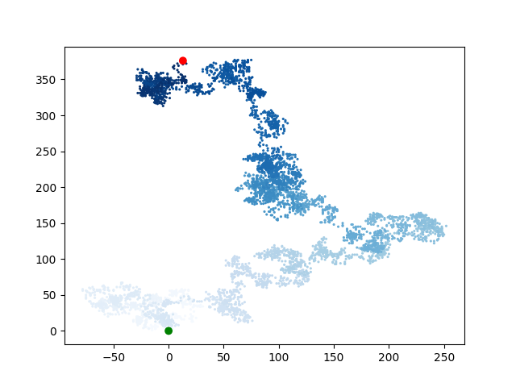

隐藏坐标轴:

```python
--snip--
plt.axes().get_xaxis().set_visible(False)
plt.axes().get_yaxis().set_visible(False)

plt.show()
--snip--
```

其他更多细节请参阅[matplotlib官网](http://matplotlib.org)

### 15.4 使用Pygal模拟掷骰子

[Pygal官网](http://www.pygal.org/)
Pygal包生成可缩放的矢量图形文件.
在掷骰子游戏中一个骰子6种结果出现的概率相同, 但同时用两个骰子, 某些点数出现的结果比其他出现的概率大.
为确定哪些点数出现的可能性最大, 将生成一个数据集, 并根据结果绘制一个图形.

创建Dice类, 保存为diceClass.py:

```python
from random import randint

class Dice():
    """一个表示骰子的类"""

    def __init__(self, sides=6):
        """默认普通骰子6个面"""
        self.sides = sides


    def roll(self):
        """返回一个1到骰子面数之间的随机数"""
        return randint(1, self.sides)
```

创建主程序diceMain.py

```python
from diceClass import Dice
import pygal

# 创建一个D6
dice = Dice()

# 掷骰子1000次将结果存储在一个列表内
results = []
for _ in range(1000):
    results.append(dice.roll())

# 分析结果
frequencies = []
for value in range(1, dice.sides+1):
    frequency = results.count(value)
    frequencies.append(frequency)

# 对结果进行可视化
hist = pygal.Bar()

"""
frequency   -- 频率/频次
title       -- 整个图形标题
x_labels    -- x轴刻度
x/y_title   -- 坐标轴标题
"""
hist.title = "Results of rolling one D6 1000 times."
hist.x_labels = list(range(1, 7))
hist.x_title = "Result"
hist.y_title = "Frequency of Result"

hist.add("D6", frequencies)
hist.render_to_file('image/diceVisual1000.svg')
```
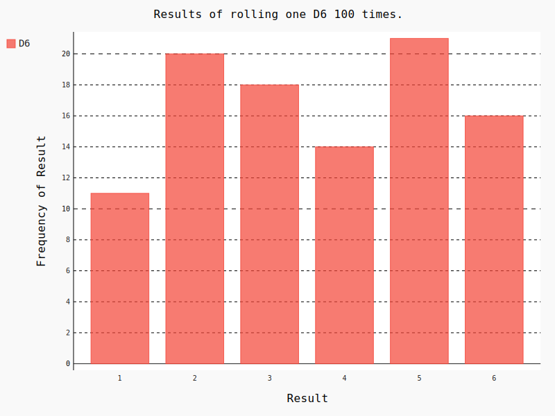
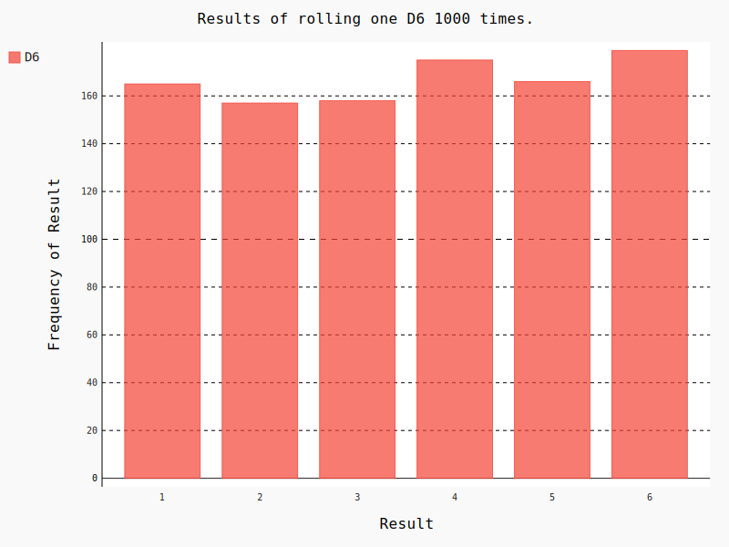

#### 同时掷两个骰子
```python
import pygal

from diceClass import Dice

# 创建两个D6骰子
dice1 = Dice()
dice2 = Dice()

# 多次掷骰子, 将结果存到一个列表里
results = []
for _ in range(1000):
    result = dice1.roll() + dice2.roll()
    results.append(result)

# 分析结果
frequencies = []
maxResult = dice1.sides + dice2.sides
for value in range(2, maxResult+1):
    frequencies.append(results.count(value))

# 可视化
hist = pygal.Bar()
hist.title = "掷两个6面骰子1000次的结果"
hist.x_lables = list(range(2, maxResult+1))
hist.x_title = "结果"
hist.y_title = "结果分析"

hist.add('两个6面骰子', frequencies)
hist.render_to_file('image/dice2Visual.svg')
```

#### 同时掷两个面数不同的骰子
```python
from diceClass import Dice
import pygal

# 创建一个D6一个D10
dice6 = Dice()
dice10 = Dice(10)

# 掷, 结果存储到列表中
results = []
for _ in range(50000):
    result = dice6.roll() + dice10.roll()
    results.append(result)

# 分析
frequencies = []
maxResult = dice6.sides + dice10.sides
for value in range(2, maxResult+1):
    frequencies.append(results.count(value))

# 可视化
hist = pygal.Bar()

hist.title = "Results of rolling a D6 and a D10 50000 times."
hist.x_labels = list(range(2, maxResult+1))
hist.x_title = "Result"
hist.y_title = "Frequency of Result"

hist.add('D6 + D10', frequencies)
hist.render_to_file('image/diceVisual6_10.svg')
```

## 16 下载数据

网上有多到难以想象的海量数据, 但大多杂乱无章, 将数据整理并可视化可能会发现别人难以发现的规律和关联.
本章主要处理CSV和JSON两个种类的数据.

### 16.1 CSV文件
CSV文件: **逗号分隔的值**

下载好天气文件, 先来查看第一行. csv模块包含在Python标准库中.
```python
# 查看文件的第一行
import csv

from matplotlib import pyplot as plt

filename = 'sitka_weather_07-2014.csv'
with open(filename) as f:
    # 创建csv的阅读器(仅打开, 还未读)
    reader = csv.reader(f)
    # 将阅读器传递给next(), 它将返回下一行
    header_row = next(reader)
    # 获取表头, 了解文件结构
    # print(header_row)

    # 从文件中获取最高气温
    highs = []
    for row in reader:
        high = int(row[1])
        highs.append(high)

    # print(highs)

    # 根据数据绘制图形
    fig = plt.figure(dpi=128, figsize=(10, 6))      # figure函数用法去官网查询
    plt.plot(highs, c='red')

    # 设置图形格式
    plt.title("Daily high temperatures, July 2014", fontsize=24)
    plt.xlabel('', fontsize=16)
    plt.ylabel('Temperature(F)', fontsize=16)
    plt.tick_params(axis='both', which='major', labelsize=16)

    plt.show()
```
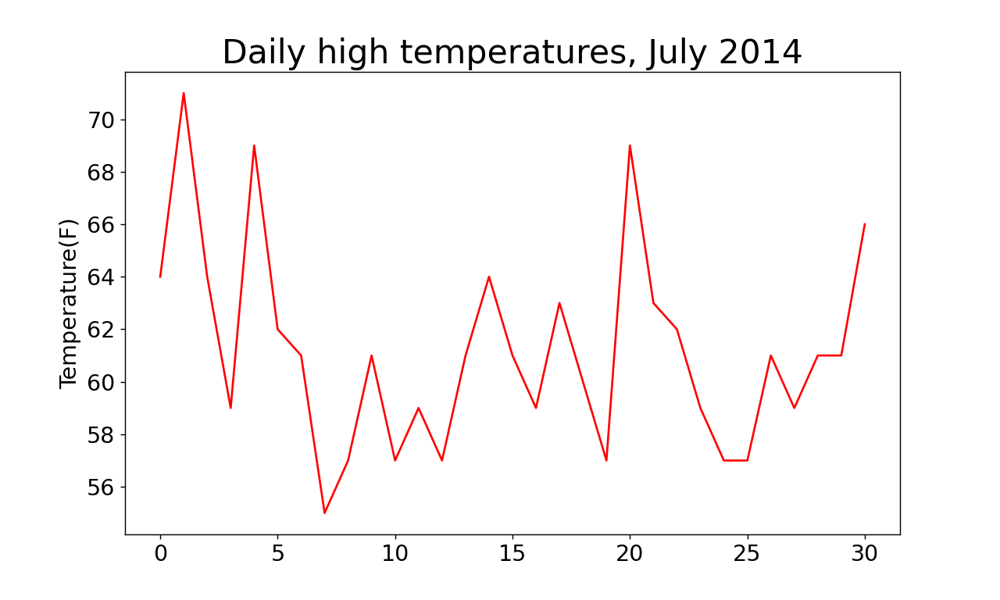

#### 给图像加上时间

时间模块: datetime

```python
import csv
from datetime import datetime
from matplotlib import pyplot as plt

# 从文件中获取日期和最高气温
filename = 'sitka_weather_07-2014.csv'
with open(filename) as f:
    reader = csv.reader(f)
    header_row = next(reader)

    dates, highs = [], []
    for row in reader:
        current_date = datetime.strptime(row[0], "%Y-%m-%d")
        dates.append(current_date)
        high = int(row[1])
        highs.append(high)

# 根据数据绘制图形
fig = plt.figure(dpi=128, figsize=(10, 6))
plt.plot(dates, highs, c='red')

# 设置样式
plt.title("Daily high temperaturew, July 2014", fontsize=24)
plt.xlabel('', fontsize=16)
fig.autofmt_xdate()
plt.ylabel("Temperature(F)", fontsize=16)
plt.tick_params(axis='both', which='major', labelsize=16)

plt.show()
```
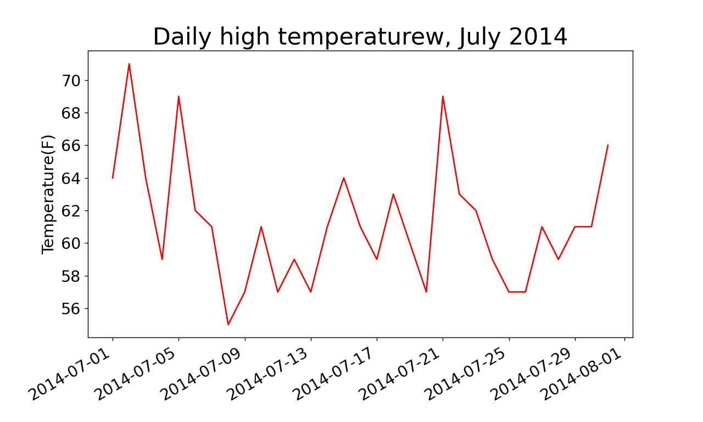

#### 最高气温和最低气温

```python
import csv
from datetime import datetime

from matplotlib import pyplot as plt

# 从文件中获取日期, 最高气温和最低气温
filename = 'sitka_weather_07-2014.csv'
with open(filename) as f:
    reader = csv.reader(f)
    header_row = next(reader)

    dates, highs, lows = [], [], []
    for row in reader:
        current_date = datetime.strptime(row[0], "%Y-%m-%d")
        dates.append(current_date)

        high = int(row[1])
        highs.append(high)

        low = int(row[3])
        lows.append(low)

# 根据数据绘制图形
fig = plt.figure(dpi=128, figsize=(10, 6))
plt.plot(dates, highs, c='red')
plt.plot(dates, lows, c='blue')     # 第二条曲线就是这么简单粗暴

# 设置图形格式
plt.title("Daily high and low temperatures - July 2014", fontsize=24)
plt.xlabel('', fontsize=14)
fig.autofmt_xdate()
plt.ylabel('temperatures(F)', fontsize=14)
plt.tick_params(axis='both', which='major', labelsize=14)

plt.show()
```
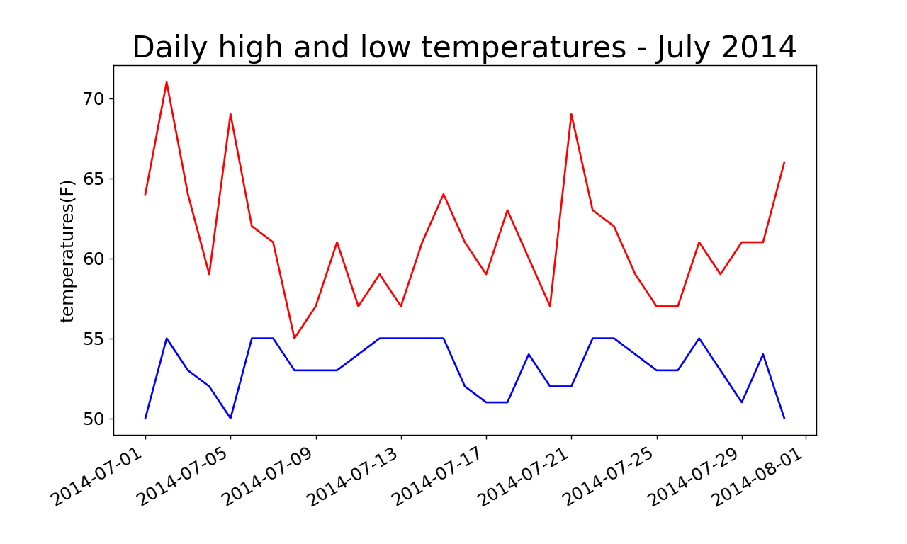

#### 给温度区间着色
方法fill_between(), 接受一个x值系列和两个y值系列, 并填充两个y值系列之间的空姐.

```python
--snip--
fig = plg.figure(dpi=128, figsize(10, 6))
plt.plot(dates, highs, c='red', alpha=0.5)
plt.plot(dates, lows, c='blue', alpha=0.5)
plt.fill_between(dates, highs, lows, facecolor='blue', alpha=0.1)
--snip--
```
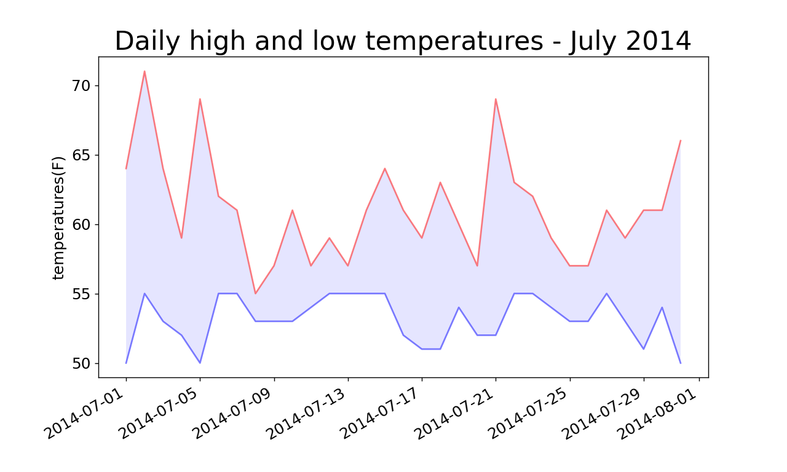

### 16.2 制作世界人口地图: JSON格式

观察下载的人口数据文件population_data.json, 实际上是一个很长的列表, 其中每个元素都是包含4个元素的字典. 国家,国别码,年份,人口.

很分散也很无聊, 略过.

## 17 使用API
API: 应用编程接口
程序使用Web应用编程接口(API)自动请求网站的特定信息而不是整个网页, 再对这些信息进行可视化.

/
