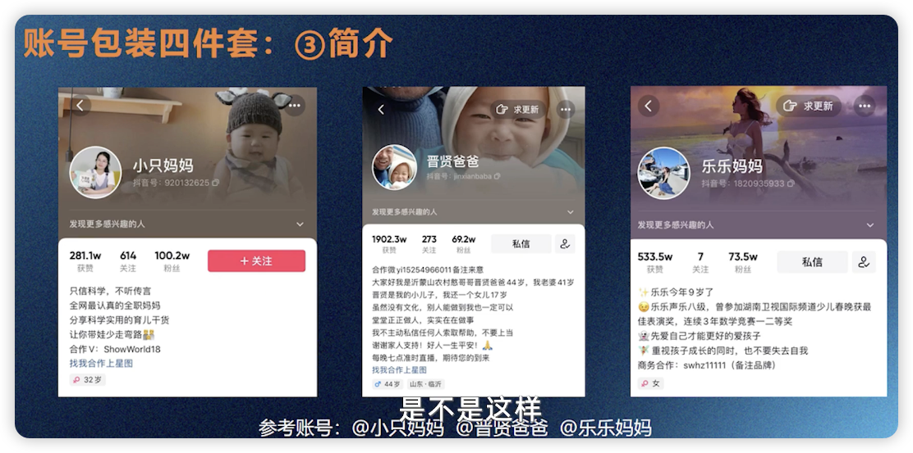
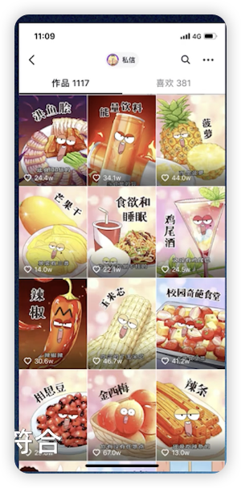
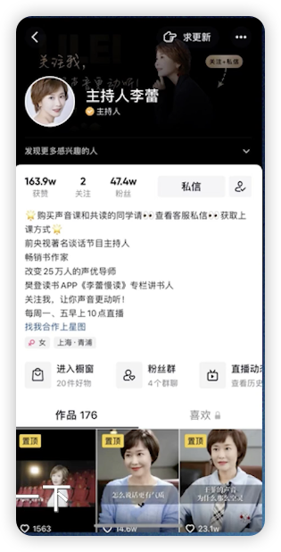

# 短视频增长策略方法论

讲师：王东梅
Date：2024.03.01

---

<mark>用营销思维做短视频: 好的产品+好的宣传=爆款IP</mark>

## 策略1：做好账号包装

账号包装的意义：好的账号包装 = 助推力，别人通过你的作品进入你的主页，好的账号保装就是点击关注的助推力！

账号包装四件套：

1. 头像: 专业/好看/搞笑，三居其一。一定要符合你的人设
2. 头图：氛围感/冲击力
3. 简介：普通人没有身份背书，根据自己的账号定位，只要把经历/观念/观点表达出来即可
   - 实例：
   - 如果身份太多，不确定要表达哪个，要遵循两个原则：
     - 重要性：默认只显示前三行，其余折叠，所以重要的要写在前三行；只有前三行打动了受众才有可能点开后面的简介
     - 人设贴合性：人设是你进行取舍的根据
4. 封面设计
   - 视频方面要统一：主题统一、风格统一、调性统一有利于高质量粉丝的沉淀和粘性的培养
   - 跟你的人设相符合
   - 优秀实例：

账号实例：主持人李蕾

1. 头像：白底扭头照，名称主持人李蕾，认证主持人
2. 头图：黑底侧面头像照，有引导关注、私信标识
3. 封面设计：应该是视频当中的截图，风格基本一致
4. 简介：[礼花]购买声音课的同学请查看客服私信获取上课方式[礼花]
   前央视著名谈话节目主持人
   畅销书作家
   改变25万人的声优导师
   樊登读书APP《李蕾慢读》专栏讲书人
   关注我，让你声音更动听！
   每周一、五早上10点直播
   找我合作上星图（链接）
   

### 万能公式，学会包装自我介绍

1. 我是谁
2. 专注于做什么
3. 他们都叫我什么——身份定位
4. 我可能是最XX——专业程度
5. 我就是那个XX——给别人提供价值

包装设计三要素：

1. 简洁明了
2. 冲击力强
3. 符合人设

## 策略2：给视频埋钩子

埋钩子的概念：引起别人的好奇心以至于“想要得到”，通常体现在**短视频标题**和**视频前5秒**。

六大爆款视频常用标题模板：

1. 标题讲故事：“他是抖音‘最没用’的网红，却治好了300万人的焦虑”
2. 标题说道理，产生共鸣：“成年人的交际礼仪，没有爽快答应就是拒绝”
3. 标题引同情：“一位外卖小哥的心声，在大城市生存真的太难了”
4. 标题提干货：“应届生都应该掌握的7个万能建立模板”
5. 标题设问句：“男女之间有纯友谊吗？”
6. 标题留悬疑：“快过年了没有女朋友，只能出此下策......”

如何判断自己的视频适合什么样的标题？
直击痛点的标题，是埋好钩子的第一步。

例子：视频内容为三天做了很多菜
痛点是“省钱” + “会做菜”：

- 标题讲故事：我只花了50块钱，就买到了全家人3天吃的菜！
- 标题提干货：学会使用这个省钱打法，50当200用！
  痛点是“家庭氛围”：
- 标题说道理，产生共鸣：即使再忙，也不要忘记全家人要经常一起吃饭
- 标题设问句：你有多久没有跟家人一起吃饭了？

> 变化之道，存乎一心，于精微处分高下！
> 同样的视频，不同的需求标题完全不同，决策点来源于痛点不同

在流量池中一般看不到标题，标题只显示在个人主页；此时就需要在视频前5秒内埋好钩子，吸引用户看下去而不是划走。
前5秒埋钩子句式：

1. 目标人群+问题+解决方案：应届毕业生不知道怎么写简历，就用这7个万能模板，搞定你的面试
2. 好奇 + 恐惧：不要因为这个小小的动作，而毁了孩子的一生
3. 好奇 + 利益：现在入职哪些职业，五年后可以实现年薪百万？
4. 好奇 + 利益 + 恐惧：互联网大厂面试都在问的三个面试题正确解析，你不会答100%会被淘汰
5. 产共鸣结论 + 恐惧：出轨只有零次和无数次，心软后果太严重
   前面是5种主要形式，除此之外只要摆脱5秒跳出陷阱的方法都是可以尝试的。<mark>关键词：钩子</mark>

## 策略3：短视频投放

<mark>会营销的人一定是会花钱的人，懂得花钱的人。</mark>

新人起号的五大原则：

1. 精准找对标：
   - 定向投放：可以向不同的目标人群投放不同的视频，当目标人群符合指定的定向特征时，才显示该视频
   - 相似达人投放：可以选择一些抖音达人，投放给该达人的粉丝或与这类达人粉丝相似的群体
   - 让账号快速打上标签，获得平台的精准流量推荐
   - 相似达人不要选大账号，要选一万左右的新起来的小账号
2. 选择性投放：不要每条都投，下面是5个投放条件（满足2~3个就可以投了）<mark>投放不是雪中送炭而是锦上添花</mark>
   1. 整体完播率没有达到20%
   2. 点赞率没有达到3%
   3. 评论率没有达到0.1%
   4. 分享率没有达到0.2%
   5. 5秒完播率没有达到30%
3. 控制投放节奏：
   - 先投100，6小时看涨粉。如果ROI等于或低于￥1/粉则继续追投200，如果ROI低于￥0.5/粉则继续加倍投放，直到数据回落为止。
4. 找准投放性质：不要一开始就投涨粉，当大于10条垂直内容才开始投涨粉；否则进入你的主页发现内容太单薄，关注的价值太低，削弱关注的动力
5. 前三条原则：发布了三条内容，看自然流量是否跑得顺利（500左右的播放量）就可以做点赞投放，让后面进入的用户觉得你的内容有很多人点赞认同；如果账号成熟起来了标签人设等稳定了，就要策划多维度的投放策略，帆书的“操老师”是投放专家，应该提起注意。

## 策略4：新人运营十大宝典

**账号的运营是一个琐碎细致长期的工作**
要想做一个能赚钱的账号，以下10点都要做到！

1. 时长控制在45秒以内，最多不超过1分钟——完播率
2. 账号内容要垂直，且坚持日更——关注理由之一
3. 账号视觉和语言包装明确统一——优化粉丝体验，显示账号的专业素养
4. 对标账号拆解，不找超大博主，而找新做的起号快的账号，参考他们的爆款选题——明确自己在生态系统中的位置
5. 写好逐字稿（250个字以内），保证稿件质量和拍摄效率——时间就是金钱，效率就是生命
   - 逐字稿结构：前5秒吸引的开场白+内容要点+结束引导关注的钩子，250个字大概视频长度为1分钟
6. 画面干净、收音清楚。（画质也是平台评判的标准之一）—— 对粉丝起码的尊重
7. 不要每条视频都投放！—— 理由见前面
8. 做自己舒服的和可持续的内容——心法之一
9. 选题禁止自嗨！**拍摄的最终目的不是哄自己开心！！**所以选题要与受众有关才好：“一招让你的手机顺畅一年”就比“手机缓存清理方法”要高明太多。
10. 账号数据以周为单位进行复盘，账号内容以半月为单位进行调整修改，切记不可操之过急。——给流量一点时间，让子弹飞一会儿

常用和常错的八个细节：

1. 旧爆款重发——重要
   - 爆了的视频还会再爆
   - 不要去把原爆款视频重新剪辑再发一遍，会被判原创度低
   - 把原视频重新录制，换背景、换录制方式等一直发，直到不再爆为止
   - 把爆款视频价值榨干为止，不给模仿者/跟随者一点机会
2. 巧用音乐/热门音乐
   - 情感、舞蹈类的账号尤其要注意，热门音乐有留住用户的作用，同时还有对情绪有起承转合的功效
   - 用同一首音乐为人设做强化，让人一听到这个音乐就知道是谁
3. 打开保存视频到相册功能：要让观众可以下载保存你的视频，才有分享出去的可能——多给自己的账号曝光的机会
4. 关联话题：适当的关联当前的热门话题就有可能登上热榜，成为爆款
5. 观察数据：尽可能多的把自己的账号加入数据平台进行监测，也可以在上面查看对标账号的信息
   - App内创作者中心
   - 飞瓜数据、蝉妈妈、新抖都要注册
6. 发视频要不要加定位？
   - 作品里带有一定的地方属性就加上
   - 如果你的内容过度垂直、或风格统一，且整体内容跟地方属性没有半毛钱的关系就别加
   - 关于POI（位置信息）：
     - 加POI有什么好处？增加曝光，新增流量入口
     - 怎么引导用户点击POI图标？口播引导，文案引导，评论引导
     - 引导点击POI会被判定为广告吗？不会！告知地址是视频内容的合理需求，例如美食探店。
7. 千万不要做那些容易限流的事
   - 触犯平台规则：仔细学习规则避免触犯（下面是常见违规/敏感词解决方法）
   1. 严禁使用不文明用语，你实在生气想骂人/使用的素材有脏话，可以使用“哔”声代替（软件当中有）
   2. 严禁使用最、第一、首选、唯一等极限词，声音有这些词没有关系，字幕做修改：“第一”--“D一”
   3. 非带货视频严禁使用或引导购买、导流的画面，如：二维码
   4. 严禁使用国家领导人、领导机关的用语。画面、声音、字幕都不可以
   5. 严禁使用刺激消费语，如优惠券、全民免单等，字幕可以使用拼音或者其他谐音字代替
   6. 非认证账号谨慎使用健康学术词，否则会被判定为没医学证明，随意指导健康。如：“治疗”、“痊愈”等
   7. 严禁使用负面词汇。如：“骂人怎么骂有文化”，“废物”等都用拼音代替
   8. 严禁使用民族种族歧视用语：“哔”声和拼音代替
   9. 搬运别人视频：根据视频源码判定，自己的视频发布到各大平台不会被判定搬运；但下载别人的视频重新编辑再发布就会带有原来发布的源码，会被判定搬运或原创度低。    
8. 爆款视频后一定不要断更：理由和方法前面有涉及，原则就是吃干抹净，爆款不易一定要珍惜！

小结：任何增长都是以好的内容为前提的，保证产品细水长流的是它的口碑；口碑则来自于好的内容，这是一个闭环！

## 总结

账号包装四件套：头像、头图、简介、封面设计

简介万能公式：我是谁？专注于什么？他们都叫我XX，专业程度，可提供的价值

包装设计三要素：简洁明了、冲击力强、符合人设

埋钩子：明白埋钩子的作用后除了课程中提到的技巧之外要用心去体会才能更上一层楼

- 标题钩子只展示在个人主页，观众被内容吸引进入主页时才能看到，作用是促进观众关注成为粉丝
- 流量池中不显示标题，要靠视频前5秒埋的钩子吸引观众看下去，后面优秀的内容才有展示机会

短视频Dou+投放：

- 明确自己的目的
- 熟悉平台的规则
- 掌握一定的技巧

新人运营十大宝典：琐碎、细致、长期、认真
运营中的八大细节：搞懂底层原理，熟能生巧

本章内容庞杂，干货满满，需要反复揣摩、体会、记忆。

<mark>历时8小时，END</mark>
