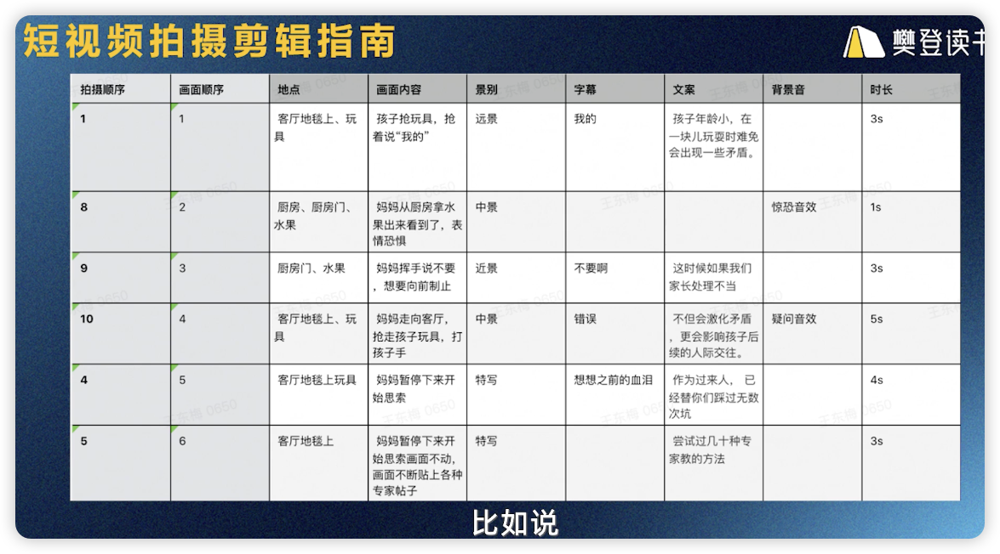
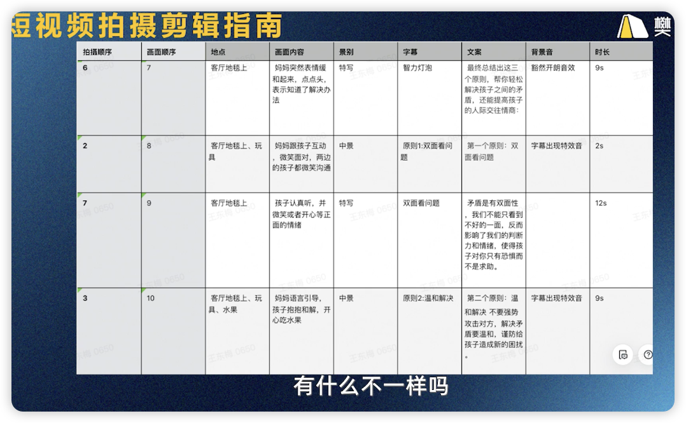
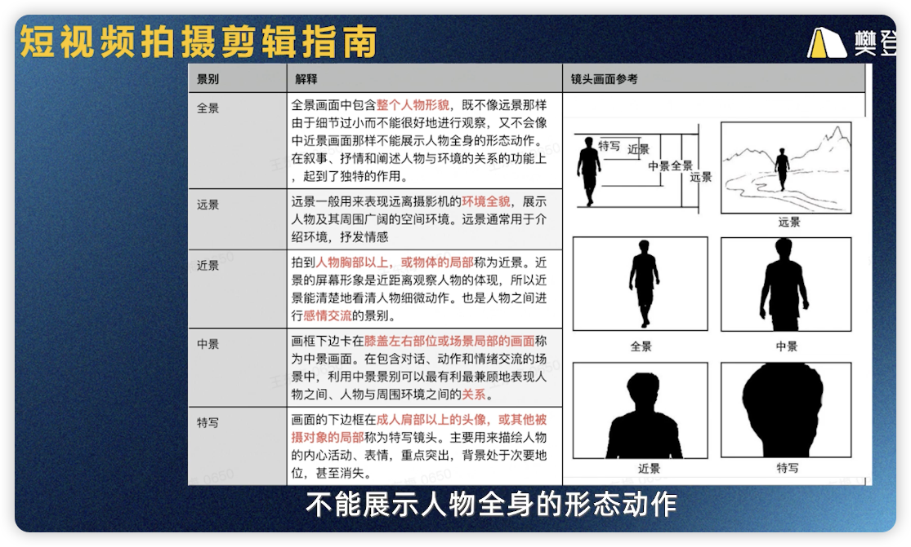

# 短视频拍摄剪辑指南

讲师：王东梅
Date：2024.02.28

---

## 1.拍摄锦囊

### 拍摄步骤

选题：

```bash
话题：孩子之间闹矛盾，父母应该怎么做？

视频表达内容：
- 首先：矛盾是有两面性，我们不能只看到不好的一面
- 其次：解决矛盾要温和，谨防给孩子造成新的困扰
- 最后：事后总结，给自己立原则，让孩子学会保护自己

展现形式：剧情
```

拍摄步骤：

1. 拆解脑海画面
   - 剧情：是我的画面表达方式
   - 孩子和父母的现实举动：场景再现，找到共鸣
   - 正确地做法：干货输出，有获得感
2. 写好逐字稿
   - 逐字稿五大万能吸引力公式：
     1. 目标人群+问题+解决方案
     2. 好奇+恐惧
     3. 好奇+利益
     4. 好奇+利益+恐惧
     5. 产生共鸣结论+恐惧
   - 前5秒，第一部分：产生共鸣结论+恐惧，“孩子年龄小，在一块儿玩耍时难免会出现一些矛盾。这时候如果我们家长处理不当，不但会激化矛盾，更会影响孩子后续的人际交往。”
   - 第二部分：表示自己很有经验，抛出利益钩子，“作为过来人，已经替你们踩过无数次坑，尝试过几十种专家教的方法，最终总结出这三个原则，帮你轻松解决孩子之间的矛盾，还能提高孩子的人际交往情商！”
   - 第三部分：简洁有效的干货输出
     - 第一个原则：双面看问题。矛盾是有双面性，我们不能只看到不好的一面，反而影响了我们的判断力和情绪，使得孩子对你只有恐惧而不是求助。
     - 第二个原则：温和解决。不要强势攻击对方，解决矛盾要温和，谨防给孩子造成新的困扰。
     - 第三个原则：消化总结。事后总结，让孩子学会给自己和事件立原则，从而让孩子学会保护自己。记得收藏去实践哦！
3. 找对标视频
   - 环境：公园，是生活场景
   - 演员：两个孩子、对方父亲、我
   - 事件：两个孩子抢东西
   - 文案：以第一人称表达，对话以及内心OS居多
   - 画面：以“我”为主角的视角看到的画面+自己表演的画面
   - 拍摄手法：多为近景和特写拍摄
   - 提取可模仿部分：
     - 有画面对文案进行充实
     - 有亲和力的近景拍摄
     - 有表达主角
4. 写脚本：包括拍摄顺序、画面顺序、地点、画面内容、景别、字幕、文案、背景音、时长9个部分组成
   - 帮我们理清拍摄要点，提高效率
   - 帮我们理清画面顺序，帮助剪辑
   - 拍摄顺序：地点相同、人物相同的原则，提高拍摄效率
   - 画面顺序：最终画面衔接顺序，按照这个顺序去剪辑
   - 地点：拍摄内容时所发生的地点或物件，进行标注，如冰箱、电梯等
   - 画面内容：要拍摄的事情，为了达到想呈现出来的效果，需要拍摄的事件。将头脑当中的设想通过镜头表现出来。
   - 景别：远景、全景、中景、近景、特写5种景别来进行标注
   - 字幕：除了画外音之外的画面解释。一般用来突出重点或标注顺序。如：上班路上
   - 文案：画外音内容或录制文案，需要写好逐字稿，录制下来
   - 背景音：画面需要配的音乐或音效
   - 时长：每个镜头的时长控制，最好在2~5秒，可根据重点不同调整画面时长。
   - 脚本实例：
     
   - 景别定义：
5. 场景搭建: 新手一般选择场景而非搭建
6. 拍摄 

### 前期拍摄准备：

拍摄器材：

- 手机+手机支架
- 美颜灯，电脑屏幕发光/手机灯，自然光线，房间灯等等
- 软件
  - 手机拍摄软件：Protake
  - 剪辑软件：剪映
  - 手机打光App：飓风工具箱
  - 提词器应用：台词大师
- 服装：
  - 干净整洁，款式简约
  - 衣物颜色与环境或背景的颜色有明显的对比
  - 根据自己的喜好和选题选择合适的服饰，得体有能从背景中突出的即可
- 灯光：
  - 室内拍摄：蝴蝶光，正前上方45度向下打光，鼻子下方出现阴影，脸上会呈现蝴蝶的形状
  - 没有美颜灯：使用手边一切可用的光源进行补光
  - 室外拍摄：原则是避免强烈的光线，阴天、下午四五点钟等是合适的时间；如果光线过亮，可以找白色反光板/白墙
- 录音：
  - 手机直录：距声源近，房间相对安静，去掉手机上连接的所有设备
  - 外接麦克风：入门级收音设备，推荐领夹式收音麦；如：猛犸LARK M1
- 布景：原则上充分利用环境，场景干净整洁，颜色尽可能纯净；与内容相匹配。
  - 绿幕抠像实现背景自由
  - 考虑前景及背景，增加视觉纵深感
  - 室外拍摄：避免人群密集以及环境脏乱

拍前总结：

- 准备好拍摄的选题，场景，以及拍摄的时长
- 拍摄器材，软件，服装，灯光，录音，布景
- 列出完整清单，确保没有遗漏

### 拍摄

Protake使用：

- 调整横竖屏拍摄模式、分辨率：1080P、帧率：30或60帧、选择自动模式
- 点击井字形网格，比例调整为1：2.2，安全区域：95或100，其他三个都打开
- 可选：滤镜和美颜，美颜过犹不及，尤其针对男士

拍摄构图：
为了凸显人物把人物防止画面中心，采用中景框到腰部以上

- 美食制作：一般全景和特写
- 知识分享：中景为主
- 剧情类：全景交代人物、环境、人物之间的关系；中景展示人物的肢体动作或局部特征，近景拉近人物之间的关系等等
- 对角线构图

拍摄角度：

- 俯拍、平拍、仰拍、上帝视角、隔物拍摄

拍摄建议：

1. 不要怕尴尬
2. 不要怕讲错；错了就停顿一下，重新说一遍刚才的话然后继续。不需要重新拍摄
3. 没有镜头感，神态不自然的解决办法：
   - 把镜头想象成亲人朋友
   - 眼睛不要直勾勾的盯着镜头看
   - 说话时恰当的手势可缓解紧张和尴尬；
   - 实在不行，镜头后方坐一个熟人
4. 不要死盯着提词器，否则很僵硬；提词器是辅助工具应该尽早抛弃。你的话不是传世经典，不严谨，不完美是常态。
5. 拍摄时眼镜有反光，尽量摘掉或变换拍摄角度
   
   ## 2. 剪辑指南

基本剪辑流程：

1. 导入素材：手机相册和官方提供的素材库
2. 选择比例，修改长度和片段、修剪不需要的，NG的画面并删掉
3. 调整声音：音量大小、可实时录音
4. 加字幕：可自动识别字幕，调整字幕样式/修改识别不准确和敏感词部分
5. 背景音乐：曲库或自有，推荐搜索
6. 设置封面：选择视频中的一帧或相册中的图片；文字可自由输入也可使用现成的模板

进阶剪辑：

1. 加滤镜：实质是对画面进行预调色覆盖
2. 设置美颜：适可而止，过犹不及
3. 转场：弱化硬切的突兀感，宁缺毋滥
4. 加特效：简单的预设直接添加

高手示例：

1. 开场：蒙版+多视频轨道+滤镜+特效等等
2. 推拉摇移技巧：对画面利用关键帧技术进行缩放平移等操作模拟拍摄时的推拉摇移运镜
   - 有预设的动感放大就是推镜头了
   - 注意加上合适的转场 滤镜

隐藏小技巧：
没用

## 3.常见问题答疑

## 4. 图文制作

抖音的图文功能，图片呈现形式与小红书比较接近，在图文底下插入文字，然后图文可以左右滑动查看。

怎么做？

- PC端：专业的PS，业余的？想赚钱还想着业余！
- 手机端：醒图，美图秀秀等

具体制作：分享生活类&图书、美食种草类

如何上传：

1. 抖音左上角加号点击发布图文
2. 导入图片
3. 添加背景音乐，文字等
4. 发布
