# 关于选题的一切

讲师：羽惜助教
Date：2024.03.13
地点：群内直播

---

## 0.基础概念

爆款短视频等于51%的选题加49%的内容，你希望想用户传递的主要信息是什么？
找对选题是短视频成功的第一步！

选题、话题、标题有什么区别？

- 选题：一条短视频的中心思想就是选题
- 话题：大家在讨论的事就是话题
- 标题：一句话概括视频内容就是标题

举个栗子：
“怎么让职场小白快速掌握职场技巧”就是话题
“高启强在读孙子兵法”就是话题
“职场中的兵法诡道”或“兵法中的职场法则”便是一条短视频的标题

## 1.怎么找选题

```bash
先做选题，再找话题，根据内容、SEO确定标题
选题决定了视频的流量下限，选题（受众）范围越大，基础流量越高
话题决定了流量的上限    #话题的热度高低，参考热点
所以拍摄、文案水平越差，视频的选题就越重要  #此处划重点，必考点！
```

选题分类：

1. 常规选题
2. 热点选题
   - 突发热点
   - 常规热点

爆款选题三原则：

1. 受众广泛：选题的受众基数一定要大，视频才有火起来的机会；否则内容再好，但平台用户关注的人少。也很难成为爆款短视频
2. 热度上涨：短视频有很高的时效性。找到30天内热度高，具备爆款潜质的内容，连续输出20条。基本可度过冷启动（新账号冷启动吗？）
3. 用户价值：做利他、有价值的内容；拍用户想看的，而不是关注自己想表达的，站在用户的角度去思考
   - 自嗨是哄自己开心；利他是为了赚钱后再用钱哄自己开心
   - **商业的本质就是价值的交互传递** 至理名言!
   - 职业厨师的招牌菜是不是自己最爱吃的菜并不重要，重要的是食客喜欢！
   - 到现在又想起了那位双博士的话：这个社会可预见的未来终点就是“娱乐化”
     - 原始积累的草莽阶段--财富集中的分层阶段--为保护各自利益的法律阶段--阶层基本固化之后的娱乐化时代
     - 上述论断是在2001年左右提出

一个没提到但又显而易见的观点是：**情绪价值才是用户价值的最高指导原则！**

## 2.如何搭建你的专属选题库

选题库就是自己的专属资源，就是自己的备货仓库
每天在里面存放自己能用到的选题，就像旺季到来的前夕要有囤货的思维

**自己或团队就像是一个传统工厂：选题库是原材料库，是生产优质产品的必要条件！**

搭建选题库

- 一方面提高内容效率。日常随手刷短视频、搜索、试用自己的选题，可以避免每日拍摄视频都要花时间临时寻找选题。
- 另一方面，可以避免灵感枯竭。随着创作量的增加，很容易遇到灵感枯竭的挑战，拥有选题库，就不用再担心缺乏可写的素材。

How to create your library:

1. 找选题：要点在于符合爆款选题的三原则（受众广、热度高、用户价值）
   - 日常推荐（自然推送）
   - 主动搜索（目的性最高）
   - 对标账号（看数据，经过实际检验的成功案例）
   - 创作灵感（官方推荐，必有道理，关键在于对平台意图的理解）
2. 放选题：类似仓库管理，分门别类、干净整洁、便于查找
   - 文件夹/目录，分类清晰
   - 电脑是核心库
   - 随身携带的手机或纸笔<mark>随时记下</mark>潜在的爆款选题
   - 床头必须要有纸笔，要有两杆笔，保证笔的书写顺畅
   - 永远不要相信自己的记忆，要相信外脑的可靠性
   - 零散收集的选题当天必须入核心库，任何情况下绝不过夜再存
3. 用选题：选题不拿出来用没有任何价值
   - 根据库存情况分出轻重缓急，指定创作和发布计划
   - 计划中要包括：时间表，创作顺序，包装的多样性/一致性的协调
   - 计划要灵活：大热点突然爆了要特事特办，不可僵化；即使因计划变动，枪毙一些项目要毫不犹豫，还是那句话：不可自嗨！

找选题的方法：

1. 算法推荐：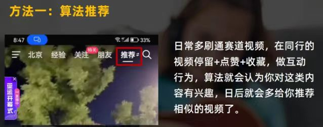
2. 站内搜索：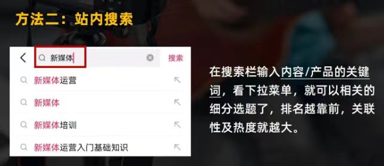
3. 对标账号：
4. 创作灵感：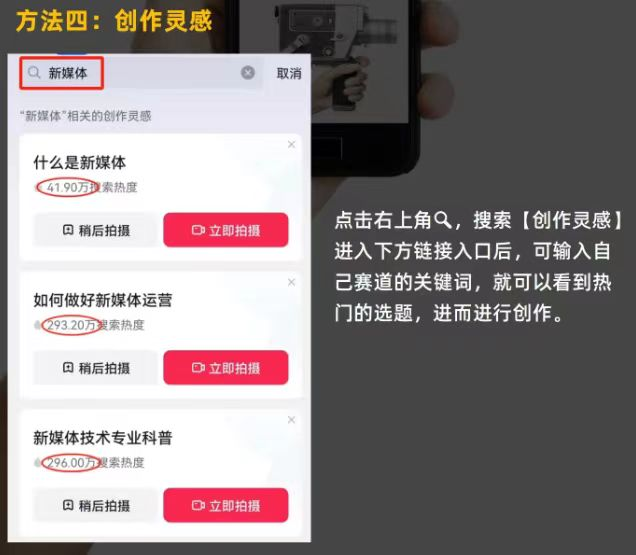
5. 自己创作：初期可不考虑，但要知道前述的最终来源还是一个个人，那个人凭什么不能是我？“王侯将相宁有种乎！”

## 3.如何根据选题写内容

选题类型：

- 晒过程
- 制作过程
- 测评产品
- 改造对比
- 事件体验
- 任务挑战

参考图片：
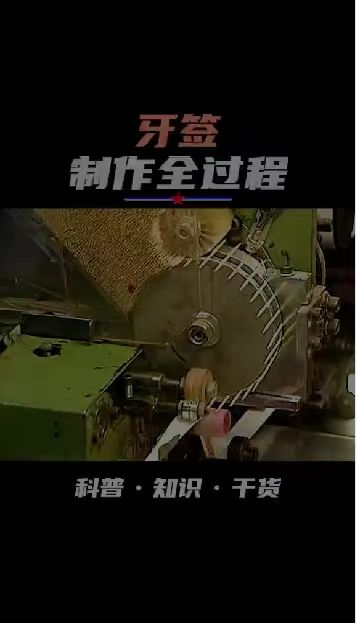
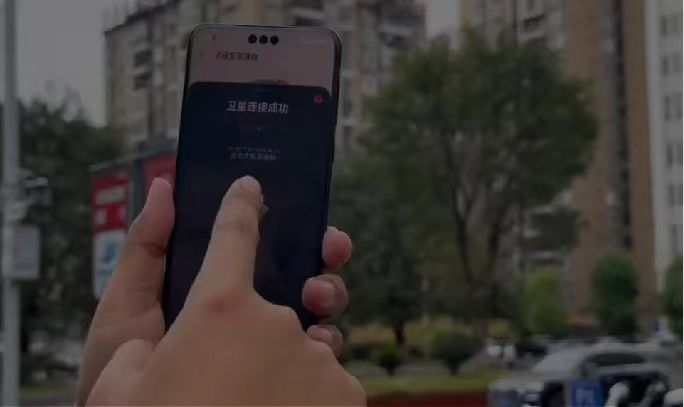


- 教知识
- 内容解密
- 避免踩坑
- 推荐建议
- 实用技巧
- 冷门知识

参考图片：


- 讲故事：
  - 成功案例
  - 个人成就
  - 人生遗憾
  - 化解矛盾
  - 经历吐槽

参考图片：


- 聊观点：
  - 我要站台
  - 批评
  - 劝架

参考图片：
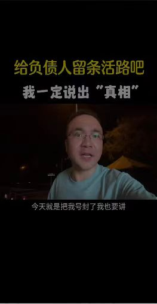


- 尬段子
- 深度还原
- 假如真话

参考图片：


- 说明产品：
  - 服务特色
  - 产品特色

参考图片：


### 3.2如何根据选题写内容

不同赛道春节选题写内容的参考：
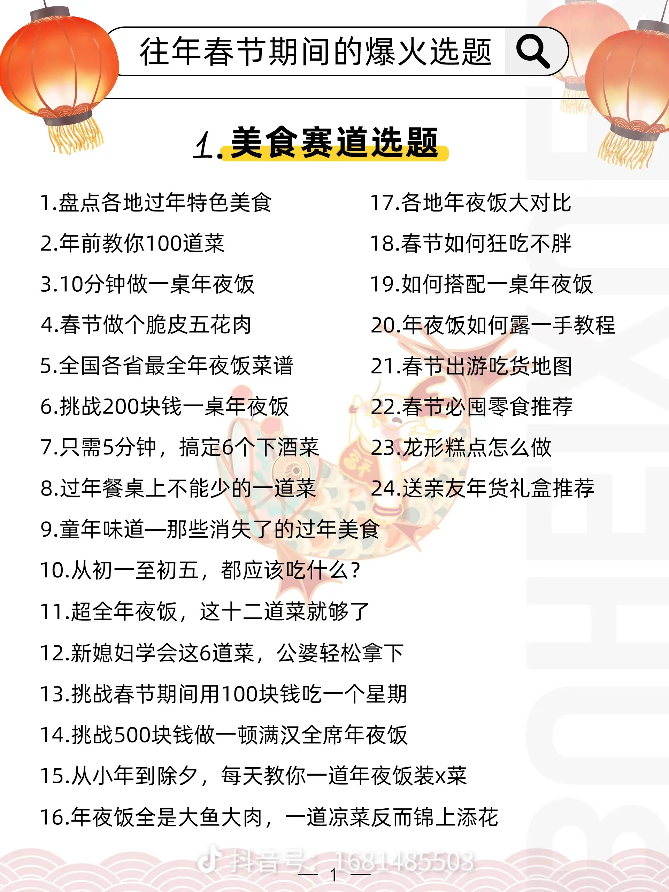
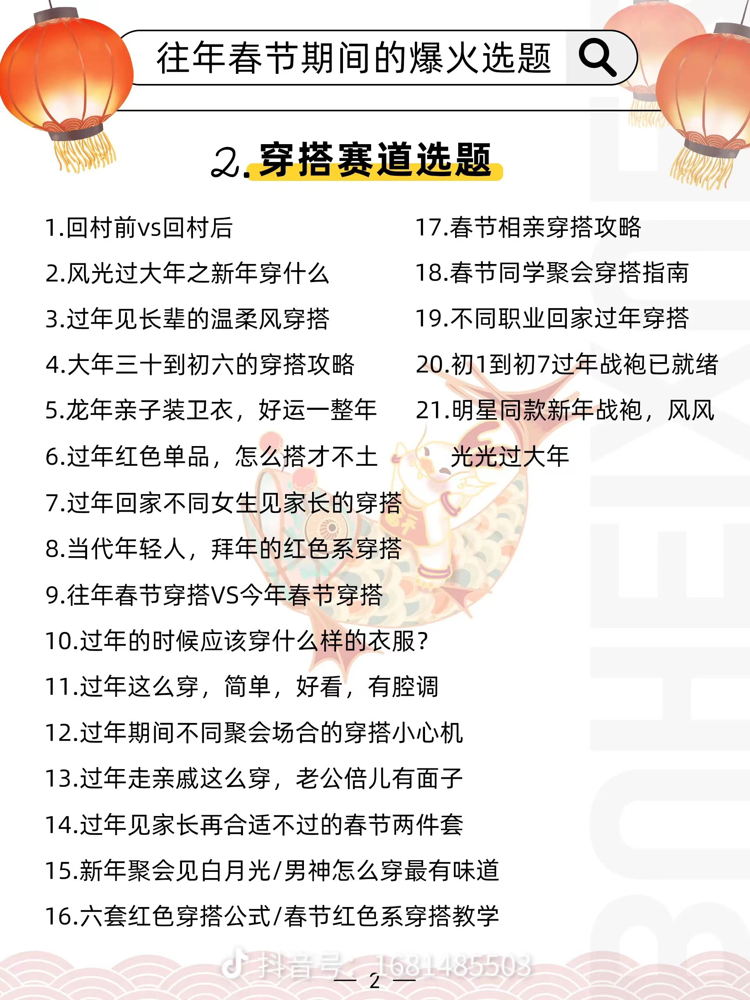
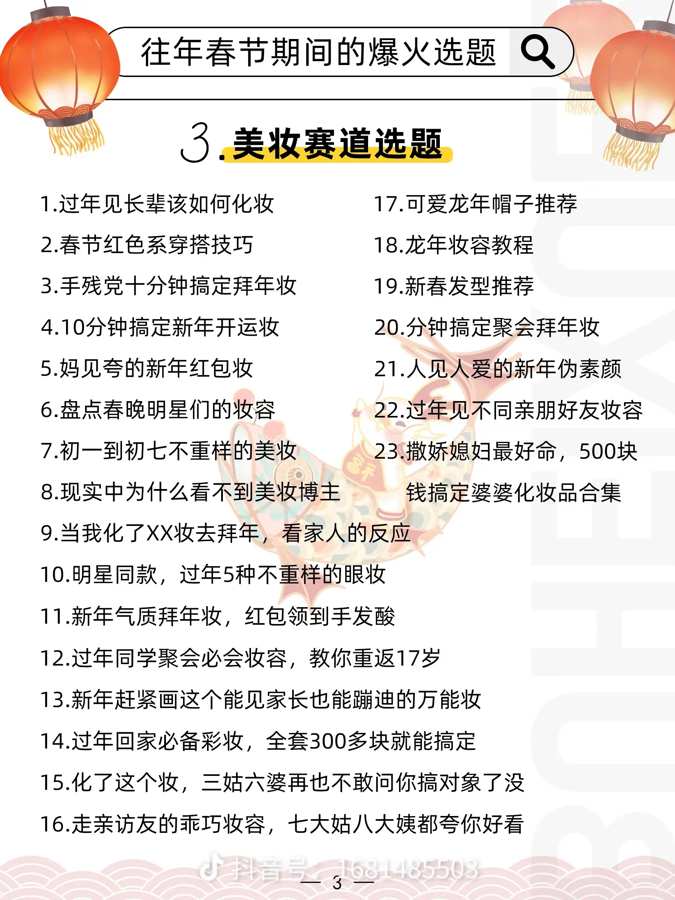
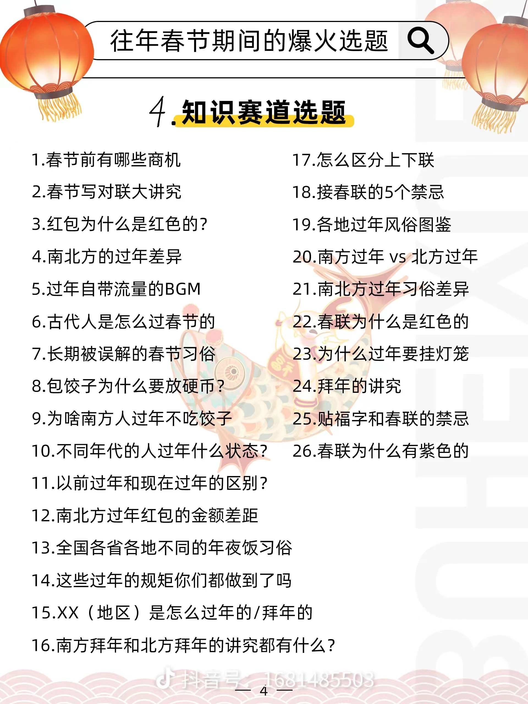
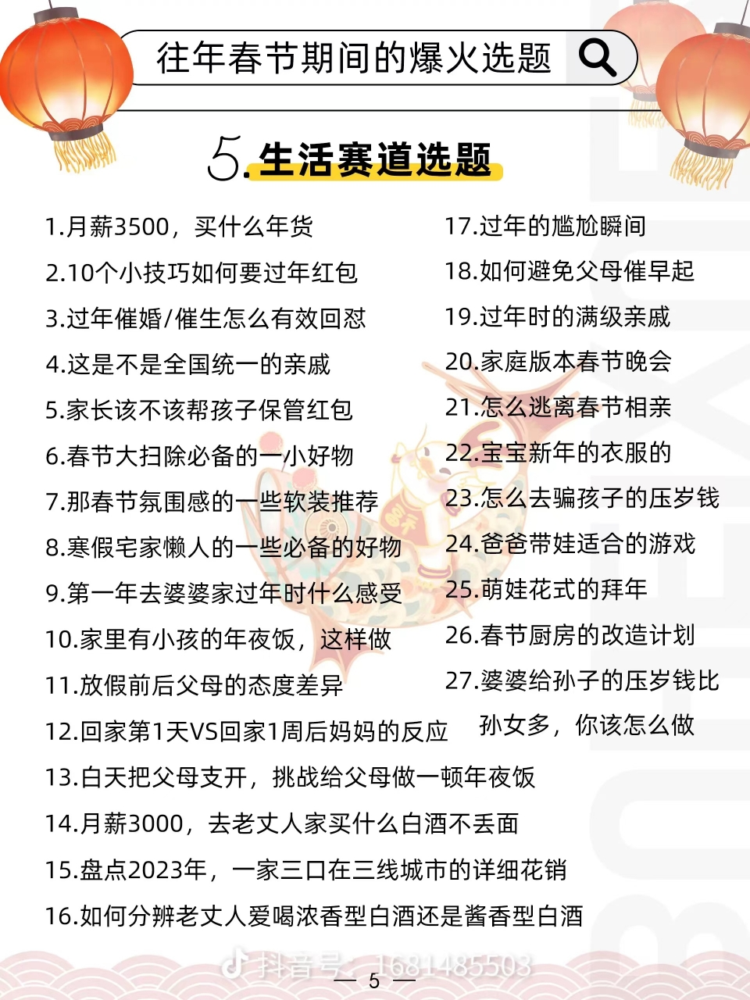
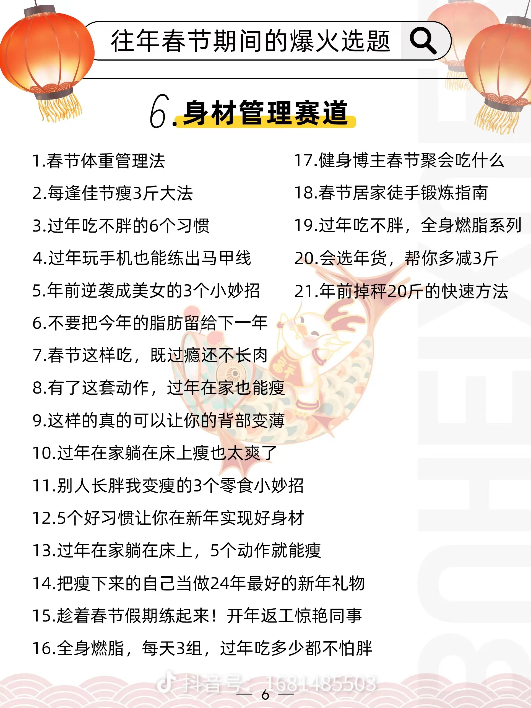
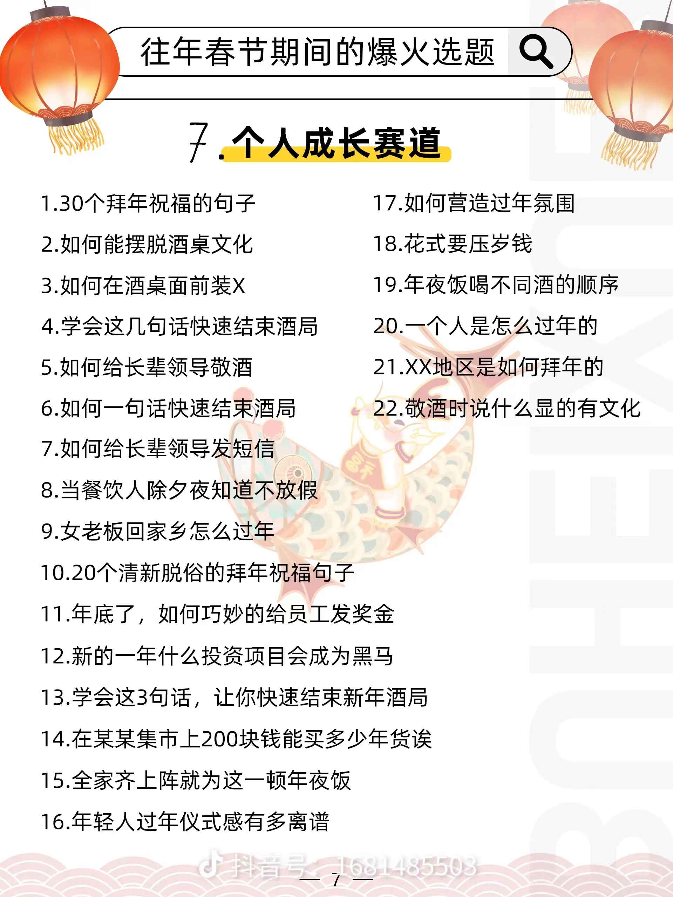
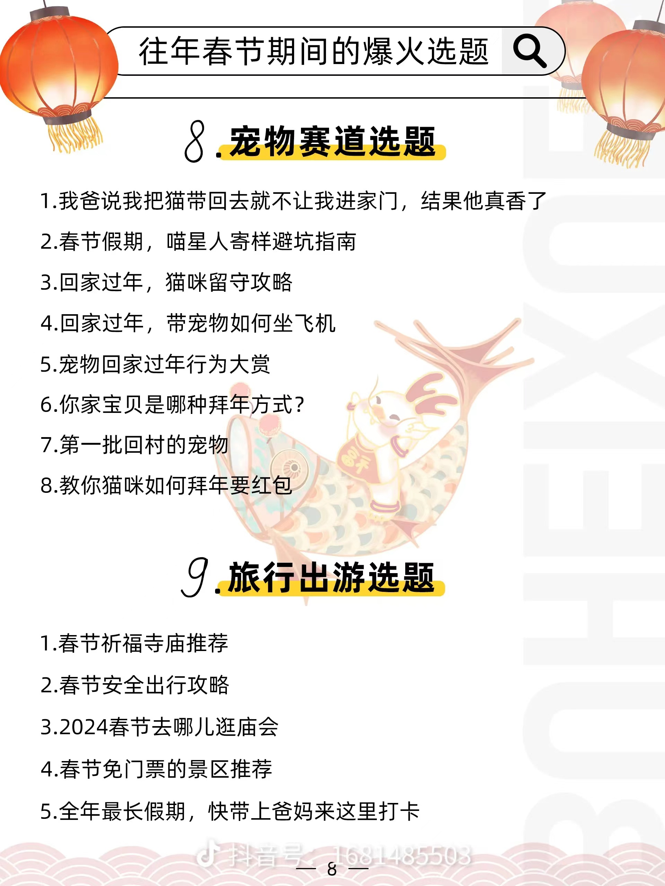
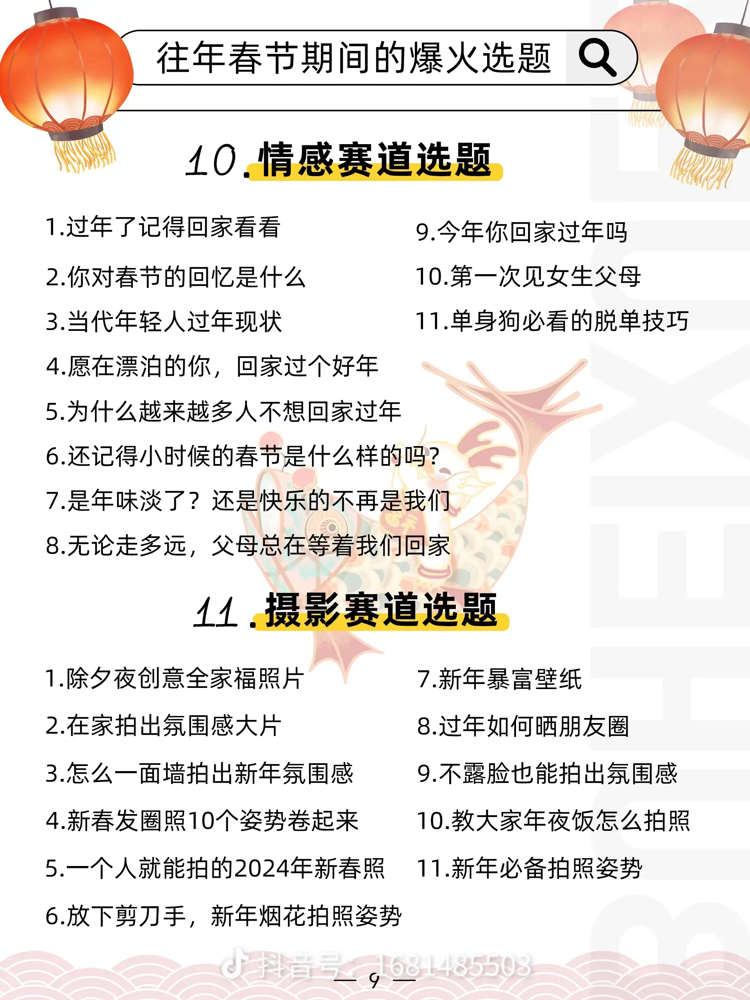

## 4.作业任务--短视频实操

三个对标模板：有短视频、拍摄脚本
根据对标视频：结合自己的赛道进行模仿或二次创作
可1:1复刻，可在模板视频基础上创新，可增加模板视频自己创作
在DAY24进行总结、盘点、表彰
要求：拍摄三条视频
晨读暂停3天，全力以赴三条短视频
