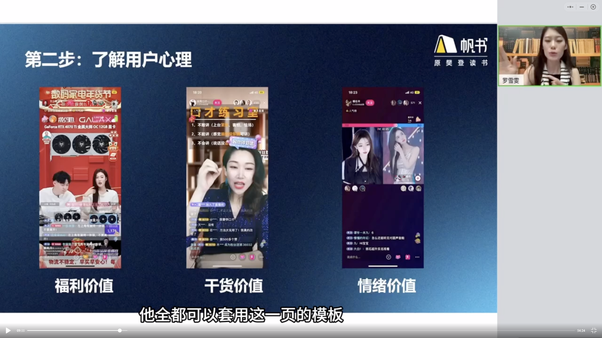

# 人人都可以的抖音直播

Date：2024.03.19
讲师：美美罗/罗雪雯

---

内容找不到、长得不好看、没场地......好多困难

打开思路

## 1.建立自身信心

- 放大个人特色/优势
- 不盲从
- 成为你自己

所谓乐观主义审视自己更多的关注自身优势；悲观主义看到的更多的是自身的不足。无论哪个主义/倾向都有失片面，每个人都是优势与不足共存的矛盾体。
是遵循木桶原理去补齐那些短板吗？如果条件允许当然很好；如果条件不允许就要遵循天线的外形，极力拔高自己擅长的一面，因为这里是互联网，你我只是无名小卒，大概率不会有人全面的关注你，他们只会关注你展示出来的一面，而这一面就能给你带来远超平常人的收入。

在与别人比较时，不要拿自身的缺憾去对比对方的闪光点，要明白每个人都是一个独特的个体，各自擅长不同。例如你擅长自媒体运营面对中科院院士时就要大胆的把这一点显露出来；面对其他大主播你可以用小白近乎无限的成长可能性来面对。

这个世界是多元的，喜欢什么样的都有，你没必要成为别人你也成为不了别人，就做自己，做真实的自己，总会有人喜欢有人不喜欢，这很正常。
<mark>做主播赚到的钱有一半是挨骂的钱。</mark>

赛道/风格/定位没有哪个更好，只有哪个更适合你！
找到它，坚持住，大的成功向来青睐于长期主义者。

实例：一个内向/内敛的人声音非常温柔好听就不适合那种打了鸡血的纯销售，但是她非常适合早晚安的阅读，自然适时地引导一下点击购买链接就可以了。
两个选择：一号链接，听书卡；二号链接，实体书。
销售收入完全不输那些激情澎湃的纯销售
她完全没必要：我要突破自我，我要变成一个外向的性格，完全没必要

## 2.了解用户心理

- 福利价值
- 干货价值
- 情绪价值

不管是哪个赛道，哪个平台，卖什么样的货只要真正搞懂了以下图片内容都可以套用！

用户为什么要来你直播间？他来到你的直播间为了什么？

图便宜、薅羊毛！占用户人群的绝大多数。没人关心你成本多少，利润如何。他们只要便宜或者叫做自我感觉的便宜！————这是福利价值
我的直播间是不是市场最低价？是不是“人无我有，人有我优，人优我廉”？是不是经常给粉丝发福利————包括福袋之类的？抽奖？

学习类的直播间：为了获取知识、获取技能。最重要的就是干货价值。

娱乐/才艺直播间：就是为了开心、解压。需要的是情绪价值

如果带货直播间同时兼备干货价值和情绪价值是不是会胜人一筹？
三种价值集中体现在一个直播间，如董宇辉、尼古拉斯.赵四
还有刚提到的声音温柔好听的内向主播在传播内容的同时也非常治愈。

三种价值最少居一，多种价值并存有爆火潜质，某种价值超出心理预期定然爆火！
以上就是用户为什么来你的直播间，如果直播间长期没人那肯定是三种价值缺失。

## 3.寻找个人特色

### 3.1 找到特色，帮助自己明确内容方向

- 你的工作：你的日常，他人的揭秘————猎奇、治愈、解压
- 你的兴趣：如果兴趣和擅长统一可以输出干货价值；若只是兴趣展现学习过程观众可吐槽、可欢乐提供情绪价值。导师/同学/卖丑/励志...
- 你的生活：家务活可提供干货价值和情绪价值
- 你的城市：找到能帮助外地人的点去直播，旅游/明星城市最好用。找到有特色的店帮店铺线下引流。

特色，注意不是特长，所谓特色要突出，要点在于和不同摆在一起，反差是特色的增强剂。
鲜明的个人特色就要在一众主播中找共同特征，然后差异化。

只要有好奇就会有关注
不要忘了你的带货目的

那些觉得没内容的其实你正在经历内容，同时也浪费着内容。————“道在屎溺”！

照顾瘫痪在床的病人：干货价值--how，情绪价值--心灵按摩

猎奇心态--卖景点相关的门票、玩偶、纪念品。
景点对本地人无感，外地人吸引力爆棚；工作无聊乏味，外行人好奇；你的生活琐碎乏味，挖掘包装有趣、有用、有槽点、有共鸣，有干货价值、有情绪价值。
有关你的一切，都有可能对外输出，还是这个思路：深挖、包装、输出

### 3.2 找到特色，与带货相结合，与别人拉开差距

普通卖裤子/唱歌+卖裤子，普通卖课程/情景剧+卖课程，普通卖女装/男主播+卖女装

所谓创意：将你的特色与内容相结合，你的特色包罗万象，这里要开脑洞。没有什么不可以，去大胆的测试，根据反馈去决定，而不是拍脑袋。

核心秘诀是深挖你身上的特色与卖货相结合，做到与众不同才能做到吸睛留人进而实现卖货的目的
直播间里没有新东西，几乎所有的创意都是老东西之间的结合成为了一个新东西。

## 4.打磨内容

### 4.1 直播前写脚本

- 你想带给观众的是什么？（情绪价值、干货价值、福利价值？）
- 主题是什么？
- 话题是什么？
- 节奏安排？
- 如何互动？
- ......

总体结构：大概5分钟到10分钟一个小闭环，重复
注意点：有临场反应不是机械重复

### 4.2 直播后复盘

- 数据
- 亮点
- 灰点
- 内容
- 节奏
- 人设
- 互动
- 产品
  <mark>唯有场场复盘，才有可能场场进步！</mark>

看巨量百应后台数据，其实就是反思是总结得失，看懂数据背后的含义；哪个时间点数据发生变化，变化的原因是什么？

### 4.3 实例

人群1：宝妈/宝爸

- 你的工作：无
- 你的兴趣爱好：无
- 你的城市：十八线小城没有鲜明特色？
- 你的生活：专职在家带娃，育儿/做饭/各类家务活
  - 特别会育儿，带孩子很有自己的一套
  - 特别会做饭，宝宝辅食，全家人的一日三餐
  - 特别擅长家务，归纳整理清洁一把好手

匹配价值：

- 育儿：干货价值
- 做饭：干货价值；情绪价值
- 家务：干货价值；情绪价值

人群2：店主（线上/线下）

- 线下：餐厅、按摩店、书店
- 线上：抖音或其他平台有店铺

特色+带货
纯销售的直播间差不多是过去式了。东方甄选开始

人群3：泛人群
干货付费连麦直播
如：法律咨询、职业发展、升学规划、考研、考公指导......
三百六十行，行行出状元。所有人的工作都可做内容分享。
甚至一事无成者都可分享失败的教训，让后来者避坑为干货，不屈不挠为情绪价值。

旅游景点直播：

- 口才好的，介绍风土人情，历史典故，文化背景，民间传说等等搭配优美的风景。提供干货和情绪价值
- 口才不好的，闭嘴。仅展示风景，让观众放松、疗愈、治愈、静心提供情绪价值。
- 购物车里放置好当地特产、门票等等
