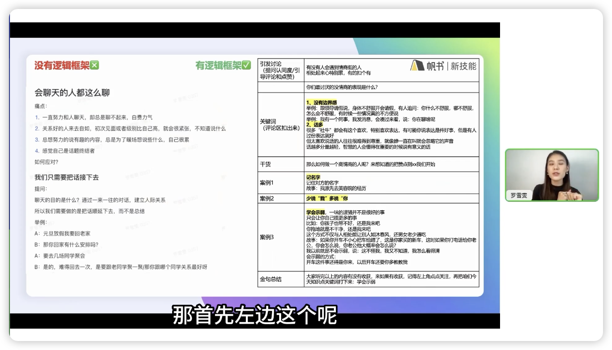

# 直播前的准备

Date：2024.03.21
讲师：美美罗
休息日预习帆书App中的直播课程

---

## 1.账号准备攻略

1. 确定已有账号是否适合直播————确认账号是否被明显限流
   - 抖音搜索：账号检测
   - 检测自己的账号
   - 根据提示进行调整
   - 拍两条短视频，24小时播放量应大于200
2. 开通带货权限/橱窗：1000粉之前不能带购物车，可语言引导：橱窗里是我的自用好物，大家可以自己去下单
   - 右下角：我
   - 抖音创作者中心
   - 电商带货
   - 立即加入抖音电商
   - 按提示提交资料即可
3. 挑选店铺/产品/申请样品
   - 主页：电商带货
   - 选品广场
   - 加选选品车
   - 搜索栏可搜产品，也可搜店铺
   - 从店铺中直接加选品车
     选品时，要从佣金、评分、增长趋势、季节、地区、调性与人设的相符程度等等多维度考虑。
     记住：佣金虽然是最重要的，但选择时的权重最低；只有高美誉度、高销量、活得足够久才能拿到最多的利润！

## 2.设备准备攻略

1. 手机直播
   - 优点：操作简单，入门门槛低
   - 缺点：无法展示产品细节内容；清晰度与电脑开播相比较差
   - 场景展示：比较固定，不能实时更新，场景模式比较单调，有局限性
2. 电脑相机直播（抖音直播伴侣）OBS
   - 优点：画质清晰；远近对焦灵活
   - 场景：切换自如，运用灵魂，可随意插入图片、视频、音乐、banner
   - 缺点：技术、费用门槛较高

手机直播物料准备：

1. 手机：高清，支持1080P以上
2. 手机支架：可调节高度和角度
3. 收音设备：无线麦克风/专业声卡+电容麦
4. 补光灯：环形补光灯、发丝灯、落日灯等等
5. 氛围物料：背景板、KT板、样品等。让用户一眼识别出自己是干啥的、重点和亮点是什么

电脑直播的物料准备

1. 摄像头/相机：高清摄像头/微单或单反相机
2. 中控电脑：笔记本/台式电脑
3. 收音设备：无线麦克风/专业声卡+电容麦
4. 补光灯：环形、柔光灯箱
5. 氛围物料：背景板、KT板、样品等

## 3.内容脚本准备（上）

每场直播实际上就是一场个人秀，要提前准备好的，是主体内容准备好了+临场反应。

- 方向一纯带货模式：对产品要求高，人无我有、人有我优
- 方向二内容带货模式：能满足用户干货价值/情绪价值，让用户喜欢上你的人、你的内容
  多思考，用户凭什么找你下单？显然内容带货要比纯销售强很多。

用户想要什么？

- 福利价值
- 干货价值
- 情绪价值
  三种价值至少占一样，全部最好

看看自己有什么能提供用户？
工作、兴趣、生活、城市

## 4.内容脚本准备（下）

直播时到底说什么？怎么说？
说什么————话题库

1. 各大平台关键词（百度、知乎、抖快红）——天下文章一大抄
   怎么说——框架脚本
2. 优质内容+做数据（互动/带货）
   - 成交转化漏斗
   - 互动转化漏斗
     必须有数据，才会有流量
     平台没有智能到可以识别判断你的内容质量高低，它所依据的只有直播数据。
     因此，优质内容+做数据就是不二法门
     设计引导点赞、关注、评论还有最重要的下单
     注意：**多想想用户凭什么会响应你的引导！**
     野路子：“宝宝们，帮我看看是不是卡了？如果卡请扣1，不卡扣2”这带来的叫评论；同时也可刷走一些尴尬的、你回答不了的问题。转移视线和焦点

脚本结构：

文案实录：《如何做一个高情商的人》

```bash
# 热情的
欢迎我们直播间的观众啊
来来来大家赶紧进到直播间
接下来
我要给大家分享一个特 别 有 帮助     # 夸张的逻辑重音
适合每个人的一个内容啊              # 掩饰不住的喜悦
叫做：如何做一个高情商的人
现在我们直播间外面的人赶紧进来啊
来听两分钟                          # 手势
一定 让你有收获
好 接下来我先来问大家一个问题       # 手势
先在评论区你们来告诉我
你觉得自己是有情商的
情商高的你帮我扣一波1
你觉得自己情商不太高的
经常说错话办错事的
你帮我扣个2                         # 引导评论
让我来看看大家的情况
我根据你们扣1和扣2 的情况来判断
我今天的知识点到底要讲到多细啊      # 利他性
啊~ 我看到今天扣2很多，是吧
都觉得自己情商不高
好 那你也可以来告诉我一下
就是你觉得自己没情商的表现是什么
在评论区让我来看看                  # 继续引导评论
反正我自己呢
是属于那种经常没有边界感
然后呢 有时候会话比较多
当然我自己有时候看到别人
我也很讨厌这种做法                  # 寻求共鸣
OK
很多人 对吧
说自己 啊 OK OK
好 明白了                           # 看评论区动作
那这样 咱们有这么多人
都觉得自己情商不高
那么接下来美美罗毫无保留
用三个方法告诉大家
如何去做一个高情商的人              # 建立干货价值期待
现在美美罗直播间呢是有2000点赞
这样咱每人点两下屏幕
咱们到3000赞可以吗？
我就直接来说干货                    # 引导点赞互动
说实话这三个内容呢
是我自己亲测 非常 有效的内容
而且这三个内容呢
是我之前自己在线下
花了将近2万块钱
专门去找老师去学习的                # 留出点赞时间，提升干货价值期待
但是老师的内容呢是非常多的
我自己去尝试实践了之后
这三个方法 是我觉得
大家明天就能够立刻用起来的          # 留互动时间，打鸡血，期待
好 我看到了大家都在点赞
是吧 OK
到3000了 我们直接来上干货啊
首先 第一个点 
来 大家一定要打在评论区哦
叫做记名字                          # 继续引导评论
就这三个字 太简单了
你就想 如果你跟一个人见面
就见过那么一次
然后你记住了他的名字
中间很久没见面
下一次再见面的时候
你立刻能够脱口而出
叫出人家的名字
他是什么感觉？
哇塞 美美罗好细心呀
天呐 我好被重视                     # 共鸣
是不是有种温暖的感觉？
所以在这个地方
就是我屡试不爽的一个方法
你们还需要花钱去拉拢关系吗？        # 强化共鸣、获得感
不需要 就这一个词
记名字 就这一个词
就能够快速拉近你跟别人的距离        # 干货价值满满
好 来 一定要打在评论区哦            # 趁热打铁，继续评论
因为有时候大家
可能听一遍记不住
打在评论区当成你的记事本好吗？      # 对观众有利的利他思维
第二个叫做少说我 多说你
来 同学们 这个点
我想先问下大家
你们平时跟别人聊天
你回想一下
是说我多 还是说你多？
让我来看一下
哎呀 我看很多人都说我               # 以调查的名义暗示评论互动
是吧 我告诉大家
举个例子
我跟我有一个朋友
她呢是属于那种永远跟她聊天          # 虚构一个人物
她的话题都是我老公怎么样
我的感情怎么样
我的孩子怎么样                      # 激发共鸣
我的生活怎么样
我的工作怎么样                      # 主播的排比功底是一项非常重要的技能
所以每一次我跟她见面
我感觉我就变成了一个捧哏的
只能说 啊 好厉害
哦 你好棒
哦 这样啊
她从来都不会说
你怎么样？
她没有把话题抛给过我
所以一整场跟她见面的这个时光
我都是在 好 嗯 对
所以大家记住了
跟别人的对话一定是你来我往的        # 全面分析
咱要多给别人抛话题
不要光话题围绕着我
你要多去用你怎么怎么样
能听明白 啊                         # 几乎全程自然的身体语言、表情、手势
让别人感受到
自己是在这个交流当中是有话语权的
OK 好
那么第三个案例叫做学会 示弱         # 逻辑重音强调
哎呀 这个点太好用了
在这 我想问一下大家
有多少人 你跟我一样
是从来都不会示弱的                  # 继续引导评论
有吗？给我扣个1
让我来看一下                        # 自然的笑声
因为说实话
我是一个北方妹子
示弱在我的世界观里压根就不存在      # 强化人设
我会觉得示弱就相当于是卑躬屈膝
你让我卑躬屈膝跟你说话
跟你去相处 那是不可能的事情
所以 每一次
在我跟男朋友去吵架的时候
永远都是你死我活 啊 鱼死网破        # 真实感强烈
但在这个时候 当我明白了
示弱 它并 不 等于 卑躬屈膝             # 逻辑重音
而是你解决问题的一种方式方法的时候
诶~？我突然一下就开悟了
我突然内心就自洽了
我不再抓狂 不再崩溃了
当我跟我男朋友去主动示弱的时候
他反而会觉得很愧疚
会主动来找我道歉                    # 对比强烈
包括这个方法运用到我的职场里
运用到我的其他的和朋友的相处当中
我会觉得我的生活幸福度立刻提升了
所以在这里 示弱 来送给大家
那么我们的三个关键词来总结一下      # 手势、语气
记名字
少说我 多说你
学会示弱
大家有收获吗？                      # 强调收获感
来
左上角帮美美罗点一波关注            # 自然的舒服的最重要的也是最困难的 数据
美美罗是每周四的晚上8--10点
都会在直播间
跟大家分享一些女性的自我提升啊
包括一些情绪处理等等问题            # 关注理由再强调
那接下来 啊 
我刚看到有同学刚进直播间
没听到前面的部分
哦 没关系
这样 咱们左上角点波关注
进到粉丝群里面
我会把今天的内容整理成文字版
发到粉丝群里                        # 强化关注理由，引导加粉丝群，私域
大家就可以看到文字版了 好吗？
我们进入到下一个话题
......
```

解析：在整个过程中，观众认为得到了情商提升的窍门，其实主播一直在引导发评论、去点赞、去关注、去加粉丝群。自然不突兀。
以上的两种不同的需求水乳交融的融合在一起了，完美！
引导他人帮你做数据最大的秘诀就是：“利他性”。这个点必须要记死
想让人帮你做数据多想想：凭什么？你是谁啊？
整个过程环环相扣，自然流畅。高手！
几个知识点：

- 循序渐进，最困难的放到最后。进直播间--好处--点赞--强化好处--调查--评论--讲解重点--评论--循环--获得感+强化--关注--后进来的没看全的--加关注+进粉丝群--结束
- 一个知识点+案例，还是自己身上的案例。亲近感、可信度
- 家常话、白话，尽量少用书面语。链接主播与粉丝的不仅仅是内容还有朋友的亲近
- 整场直播就是一个话题加一个话题的循环，这里的循环是引导数据的循环
- 有优质内容、有漂亮的数据，直播间怎么可能没流量呢？

引导别人帮你做数据唯一的驱动力就是：利他性
让用户觉得：这是为自己好。获得感！！！
操作原则：自然、不突兀——把直播内容和做数据做到水乳交融，自然流畅。这也许就是主播的核心技能

本集实例必须反复听10遍以上

## 4. 开播教程

手机版开播步骤：

1. 首页点击+号，选择直播版块
2. 设置
   - 直播封面：制作优质的封面，吸引更多人点击进入。现在封面的重要性下降了
   - 直播标题：一句话突出最强卖点，很重要。
3. 标签：选择一个合适的话题方向来获得更多的精准流量
4. 挑选商品：选择自己橱窗中的商品链接

电脑直播步骤：

1. 需要下载软件：抖音直播伴侣（推流、画面展示）
2. 需要直播中控台电脑（台式机好）：巨量百应网站（上下架产品、直播数据详情、复盘）
- 抖音直播伴侣，手机扫码登录，设置封面、标题、话题方向、添加视频画面/调整
- 添加素材，背景图片视频文字等
- 设置：注意图层，扣绿幕
- 点击商品会自动跳转到巨量百应网站、登录、直播中控台
  - 用户的评论
  - 直播实时数据
  - 直播商品信息等
- 挑选商品--添加--编辑最大的卖点
- 开始直播--就可以看到实时直播大屏了
- 推荐边直播边注意后台数据变化情况，以便进行实时调整
- 推荐录屏以便精细化复盘

推荐前期手机直播即可，电脑版直播要求1000粉以上才有资格
区别在于电脑直播可以添加素材，场景效果好一点。
