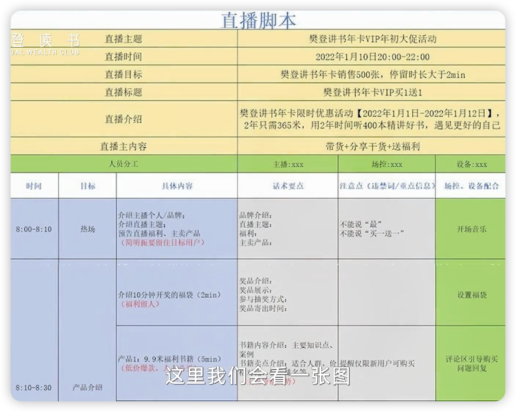
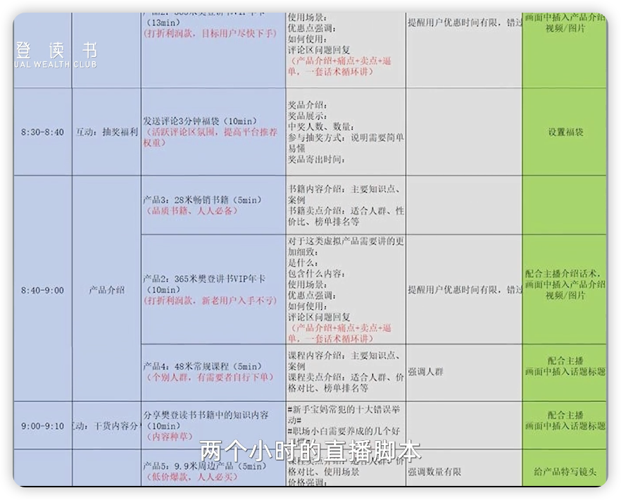
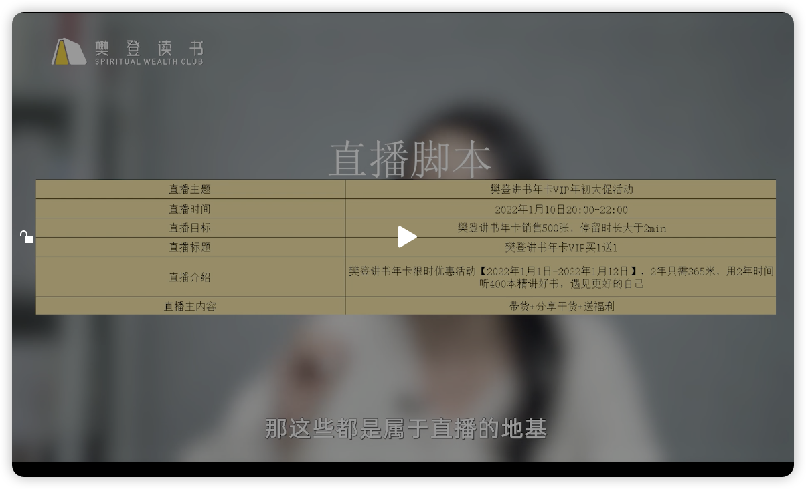
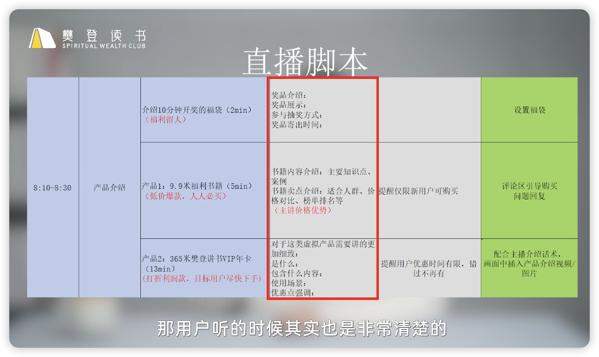

# 直播进阶

Date: 2024.03.26
讲师：美美罗

---

## 1.直播间脚本策划与撰写

直播就是一场精心策划准备的演出，需要多部门协调合作才能完美。

脚本：就是一张表来记录什么人在什么时候，做什么事情，说什么话。

- 什么人：主播、助播、各类运营人员
- 什么时候：在哪个环节
- 做什么事：带货还是抽奖、才艺展示等
- 说什么话：就是指话术，包括引导购买的话术、欢迎、结束等话术

脚本的重要性：

- 明确目标：指明了本场直播的主题和方向
- 明确人员分工：这是密切协调的基础，才能形成一个整体组织
- 把握内容节奏：起始、交代、发展、高潮、反转、起伏跌宕才不乏味
- 掌握具体话术：内容脉络清晰连贯、整场直播始终有一口气存在，连绵不绝，暖场、铺垫、催单等等话术才能自然舒服

脚本实例图：

直播脚本包含的内容：

- 直播主题、时间、目标
- 人员分工及具体工作内容
- 精确到分钟的具体环节
- 产品的具体话术

写脚本的小技巧：

1. 直播节奏是有固定公式的：
   - 整体结构：热场10min + 产品介绍20min + 互动10min + 结束
   - 产品介绍和互动为一轮，互相穿插循环
   - 互动包括：抽奖、干货分享、飞行嘉宾、互动游戏、才艺展示
2. 产品排列要有“呼吸感”
   - 直播间产品分类：福利款、利润款、畅销款、常规款
   - 不同款式产品穿插来卖，才有所谓的呼吸感。呼吸顺畅与否在于产品出场顺序和出现频率是否合理。
   - 常规排列：福袋来福利留人+暖场，低价爆款快速下单烘托气氛，利润款重点推介顺势下单
   - 目标：路人、新粉丝、老用户都要下单。流量充分转化。
3. 话术关键词有条理、细致不啰嗦
   - 有条理性：把产品的每一个点拆分出来，逐个讲清楚
   - 细致不啰嗦：每个点一两句话说清楚，精简且有重点
   - 把产品相关的信息介绍清楚是目标、观众喜欢听是要求
     

脚本在手，直播不愁！

## 2.进阶直播间创新玩法

如何用“场”赋能我们的直播间
直播三要素：人、货、场
新手时期，主播熟练度不够、选品没经验是常态，此时场的作用最为明显，也最容易达成，对前两项是一个提升
成熟期后，作用相对就平均下来了

场包括的三大模块：（以美少女蹦迪带货零食为例，秀场娱乐方式带货）

- 基础设施
  - 电脑绿幕抠图
  - 画质高清,HDR
  - 重点突出
- 氛围装饰
  - 背景图片和视频：背景图片简洁，红色让人容易冲动下单
  - 人物的服化造型：差异化的女团标准打造
  - 小Banner贴纸：根据时间，重要程度及频率进行适当展示
  - 实体道具：主推产品放置在前景
  - 背景音乐：动感音乐
- 内容玩法

脑洞大开场：
主播不给力时，有个直播间给出了摆烂式直播，效果不错。
关键节点在于，他是第一个，别人看见会眼前一亮，因为新鲜。需要注意的是太容易模仿，多了就不灵了。如果走这个路子，就要想办法把摆烂做到极致，构建自己的护城河，也就是保证差异化。差异化才能引起兴趣和停留

<mark>直播间的底层逻辑：千方百计吸引你停留，这是成交的第一步。</mark>
当你想让直播间走出自己的风格时，你真正需要的是创意的能力

方法论：

1. 有效看直播：要从人货场三个角度去分析这个直播间
2. 带着问题去看直播：有目的去分析、研究、吸收，目标是为我所用
3. 你的玩法**一定**要和你的品牌调性相结合
