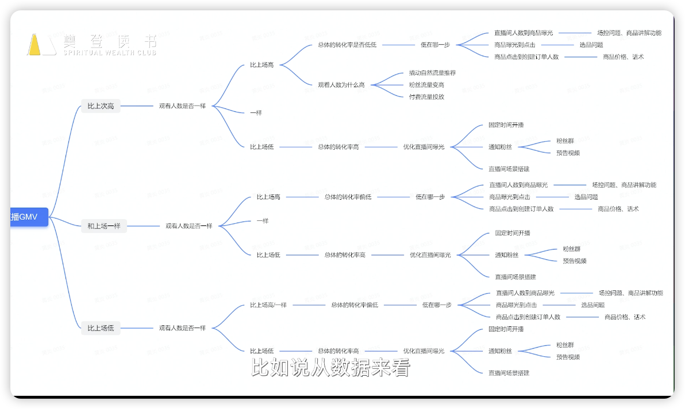

# 常规直播运营玩法和非常规玩法
讲师：黄炎
Date：2024.03.29
---
## 1.运营常规玩法
常规：除了大促之外其他月份的规划
非常规：节日大促

常规直播运营的重要性：
1. 维持健康的业务状态
2. 辅助大促获得更好的成绩

如何制定常规目标策略：
1. 自我分析：行业、产品、用户画像、对标账号等等
2. 定阶段性目标：目标年销售额1亿，常规月份就是1000万
3. 拆解目标：将大目标拆分成小目标，考虑实际情况保证完成
4. 拆解资源：资源向达成目标倾斜
5. 目标匹配资源：现有资源分配，短缺资源如何补足

人的运营策略：
1. 主播的排期策略：最大化利用资源
    - 黄金时间段尽可能匹配最好的主播
    - 根据粉丝活跃时间匹配主播
    - 固定时间开播：有利于老粉丝观看
    - 根据主播自身特性匹配不同货品
2. 团队合作：团队氛围影响用户停留时长
    - 主播
    - 主播运营
    - 店铺运营
    - 直播间技术员等

货的运营策略：
1. 在不同时期来定制转化率高的商品
    - 季节性：春节年货、情人节情侣用品、暑假学生相关等
    - 时间段：每天不同粉丝的活跃度在各自的时间段不同
2. 测试新的爆款潜能商品：爆款有生命周期，要为未来做准备
3. 常规促销玩法：限时秒杀、满减等

场的运营策略：
1. 基础设施
2. 氛围感装饰
3. 内容玩法

场的特定玩法：
1. 整点抽奖：拉高直播间活跃程度、在线人数、停留时长等
2. 入团福利：提高直播间的基础流量，入团福利作为利益诱饵
3. 福袋：抽福利或实物，可设置领取福利门槛和时间：加粉丝团、评论、点赞等等提升互动数据的行为，并且提升了停留时长

运营策略的复盘：计划与实现情况及背后的原因
1. 目标策略
2. 人的策略
3. 货的运营策略
4. 场的运营策略

思维导图：

绝大多数情况下，整体运营总有提升空间，就看你愿不愿意改进了

人货场密切相关，缺一不可。

## 2.大型节日的直播活动运营策略
大型活动节点和常规运营的区别：
- 销售目标：大型活动销售目标更高。
- 时间：大型活动运营时间短，节奏更紧凑
- 直播间装修：大型活动更有氛围，玩法丰富
- 资源：需求更大

### 2.1怎样才能达到大促期间的目标

大促期间人货场的增长点：
- 人：增加排期，拉长直播时长
- 货：更大的优惠力度，更丰富的促销活动
- 场：定制直播主题，设置更多福利

大促期间的运营复盘：
- 时间：大促复盘周期更短
- 数据对比：
    - 以往自身的数据
    - 行业大盘比对自身所处位置
- 售后：看退款退货率+好评率
- 供应链：盘点产品库存+商品价格，保价策略更注重对价格的把控

大促直播的效果其实就是你日常运营效果的成绩单

问题思考：
1. 一个粉丝进入你的直播间购买了产品，需要经过哪些环节？
    - 搜索进入：快进快出；决定进入的是你的SEO排名和直播间氛围；目的性强、货本身的性价比最重要；男性资深用户居多。
    - 直播广场进入：平台进行标签匹配，将用户推荐到直播间门口，直播间整体氛围吸引到用户，主播使用话术使得用户停留，讲解产生购买欲望，下单。
2. 提高进入直播间的粉丝量有哪些方法？如何提高购买率？
    - 撬动自然流量推荐
    - 提升直播间人和场的吸引力
    - 粉丝流量变高
    - 付费流量投放
    - 短视频预告
    - 粉丝群开播通知
    - 固定时间开播

    1. 提高选品眼光
    2. 价格优势
    3. 主播话术引导
