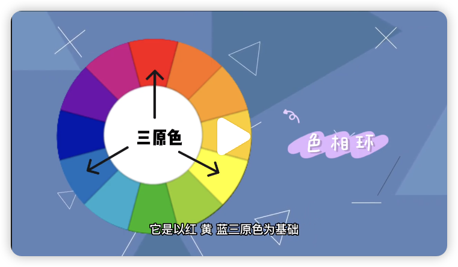

# 短视频配色法则

Date：2024.03.15
来源：群内链接到小红书
讲师：Prof. Lanshan

---

色相环：

## 1.同色系搭配：优雅有诗意

色相环30°以内的颜色
同类色：性质相同，但有深浅之分的颜色
深红与浅红、浅绿与绿色、蓝色与深蓝
景物与人物趋于统一，和谐相融
多用于旅拍类短视频

缺点：容易使画面色彩单调，频繁使用会显得乏味

## 2.相邻色搭配：和谐宁静

又称相似色，色相环相距大概60°左右的颜色
统一和谐、柔和压制、感情特性一致、容易营造层次感。
感情特性一致，比同色系更容易营造出丰富的层次感

## 3.对比色：视觉冲击强烈

色相环中相隔120°左右的颜色
红与蓝、绿与橙、黄与紫等也叫撞色
撞色搭配会让画面充满活力、鲜明华丽

缺点：颜色之间缺乏过渡，容易散乱，引起视觉疲劳。

## 4.互补色搭配：增强效果

色相环上直线面对的颜色

效果强烈，但容易出错
例如：东北大花布，原因就是红与绿平分秋色，互相拉扯，很土。
解决思路为分清主次，就好多了，如万点绿中一点红、古建筑中的以红为主的绿色点缀显得恢弘大气
另一个思路是：降低互补色的明度或饱和度，让整个画面呈现高级的莫兰迪色系也就是淡雅的灰调，就非常的柔和耐看了

对于新手来说：同类色或相似色容易把控，等熟练后再尝试对比和互补色
巧妙使用互补色和对比色，可以有效的提升辨识度

简单易懂！
END
