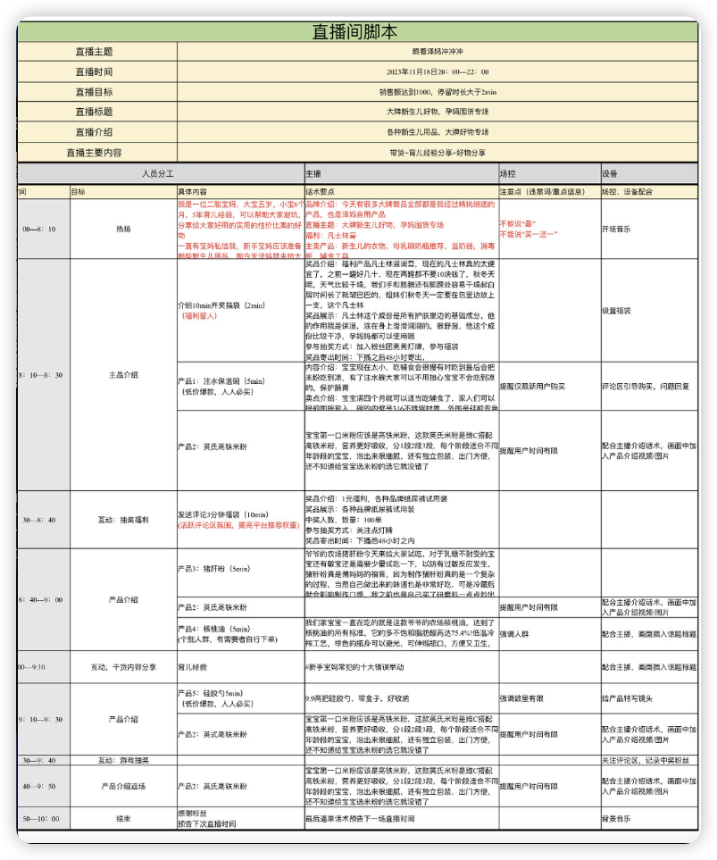

# 直播纪要
Date：2024.03.29
主讲：思辰
主题：策划一场直播
---
脑洞大开暖场，是不是开场的方式之一？

思辰组长：我们今天活动的主题呢，是策划一场直播，大家明天要写这个作业对不对？要写一场直播之前的脚本和策划方案，那今天就带着大家一块儿梳理一下，我们从作业要求。和直播脚本的一些知识点回顾，以及更多的作业思路，这三方面去帮助大家能够明天顺利的完成作业

思辰组长：首先呀，我们来看一下明天这个作业要求，第一点呢，是策划一场与自己定位方向相关的直播流程加直播脚本。可以运用课程中提供的编写脚本的模板，也可以借鉴拆解过的对标账号的流程和脚本。

思辰组长：然后第二个呢，就是将你写好的直播脚本和流程，上传到我们明天的小额通打卡中。

思辰组长：也就是说，我们首先要清楚你自己的定位方向是什么，然后根据你的方向去写一个直播脚本，跟你想如何做这场直播的策划，写好以后上传到咱们的鹅打卡中，好多同学可能对这个直播脚本怎么写。策划案怎么做？没什么思路，那在帮大家梳理思路之前，自身想问问大家还记得自己的定位吗？当初的技能还记得不记得？小伙伴可以把你想做的赛道，你对自己的定位发上来。

思辰组长：我看到怡然自乐说宝妈，然后这个亮子说奶爸，阿平说女性成长很棒啊，大家都有着清晰的目标，以终为始呢，是一个很好的方法，能够让我们带着目标去学习。去思考总结，那我想问问大家，你们觉得构成一个脚本都需要什么呢？

思辰组长：嗯，开场暖场自我介绍，产品介绍，内容输出对不对，其实啊，一个脚本呢，就是你的话术稿，那在这个脚本里面，你要捋顺清楚，你要几点播播什么。你的受众直播间画像是什么，你的每个时间点的互动要做什么，而这个互动在这个时候做的目的是什么等等，对不对？所以这些你都要想清楚，对吧？

思辰组长：除此之外呢，你的直播间如何打造？这就进入到了我们的人货场的话题，这些都是围绕着你的整体风格来定的，那接下来思琛给大家分享个往期学姐的优秀作业啊，大家可以参考一下。

思辰组长：大家能够看到啊，这个作业里边儿把正常策划做的很详细，包括产品，内容啊，游戏啊，主题等等，他整个直播流程是比较完整的，他本场直播主推的产品呢，是婴儿的系列产品。首先看他的开场的自我介绍，接下来预告今天的福利已经以及进行热场产品的介绍的过程呢，都非常的详细，可以让人放心的去购买。

思辰组长：还有他对产品的特点，安全性以及用法和食品的做法都做了比较详细的介绍。哈福大热场每隔20分钟吸引粉丝停留，引导互动，抽奖福利。还有他的每个环节，都有场控需要配合的点，而且还有育儿的干货知识的分享，那整体来说，他的整场直播策划是比较好的。

思辰组长：大家可以把这个图片保存下来，然后今天活动结束呢，可以按照这个模板，可以去构思一下自己的直播的脚本要去怎么写。

思辰组长：那接下来咱们就关于这一次的作业，我帮大家梳理了一些逻辑思路，敲重点了啊，大家的小本儿本儿你们准备好了没？来，能跟上思晨的节奏的小本儿本儿已经摊开的，给思晨举个小手儿。让我看见你们都还在吗？怎么没人了呢？是不是觉得有点儿难呢？

思辰组长：好嘞，看到很多同学都能跟得上啊，那咱们就继续说到直播，其实他的核心逻辑就是人或场，人呢，也就是主播是起号儿的核心关键。而主播的镜头感和语言流畅度，以及形象、状态、声音都是非常重要的。大家觉得一个直播间首先吸引你的是什么？你会留观的点是什么？

吸引的是场、主播状态，留观是内容

思辰组长：我看还有说内容有价值，对，你们说的都非常对，我们一起来回想一下，当我们刷抖音的时候，看到一个直播间，第一眼映入眼帘的是不是一幅画面？看起来很好看的画面，或者说让你很有记忆点的画面，然后会看他推的内容是不是你喜欢的，对不对，是不是这样，所以呀，人都是视觉动物，眼睛的感官能够传递给我们的大脑，然后大脑会迅速的做出一个选择。喜欢或者是不喜欢，在心理学上管这个叫做麦拉宾法则，也叫55387定律。

思辰组长：这个定律呀，它讲的是我们与人交流的时候，对方感知到的信息呢，55%是通过看那由说话人的形象，讲话的状态，肢体的语言，面部的表情。他的专业度可信度这些决定的，那38%呢，细是由细节，指甲呀，妆容啊，眼睛皮肤这些决定，那只有7%是你的状态。情绪是不是饱满的，有没有给你带来情绪价值？由此看来呀，我们在直播间的形象其实是非常重要的。

思辰组长：那有的同学可能会问啦，不是说人是起号的关键吗？内容是王道吗？没有错，但是没有一幅很好看或者有近一点的画面，又怎么会对这个主播感兴趣呢，对不对？

形象与内容并不割裂，好的形象让人愿意驻足，才有机会展现内容

思辰组长：那接下来我们来说货货，也就是内容方面，我们可以本着你先说清楚，再把它说的精彩，先立个框架，我再去组建内容。先把稿子写出来，然后再练流畅，以这样的原则啊，不断的去复盘，不断的去优化我们的话术，我们一定要记住，先生成，再完美，不要因为担心做不好而不去做，过程不精彩。不重要，重要的是坚持，每天都在进步。

先清楚再谈精彩，先完成再完美

思辰组长：这一点我相信我们群里的伙伴每一个人都能做到，因为通过大家的刻意练习，思辰就能感受的到啊，咱们班的学员都特别棒，每个人的进步都很大，那接下来啊。是如何正确的选品和排品，这个也非常重要，我们在选品的时候需要给我们的产品划分等级，S级、a级、B级和福利品。

选品参考成熟实体店。

思辰组长：首先说到福利，大家肯定都知道搞活动的便宜的对不对，像这种九块九啊，19块九薅羊毛的付款无压力的引流儿款，像这样的产品，它性价比非常高。就必须是大家所需的产品，而且呢，是能够让用户占到便宜的产品，大家都知道消费者的需求啊，不是要你多便宜，现在这个时代，所有人买东西都知道一分钱一分货的道理。但是大家就是要有那种占到便宜的心理，还有专属的体验感啊，所以我们有时都是要赔钱去做的，比如市场价29块九，我们要做到九块九来吸引用户进入直播间，增加停留。但是这个品他也不是随便就能给客户的，对吧？

思辰组长：对，二手科学家说的特别对，选品要参考成熟的实体店，其实我们在网上经营你的直播间儿，就等同于在线下经营的一个实体店，你一定要去有这个思路，你这些选品你要怎么选，哪些是你的利润品，有哪些是你的福利品啊。

思辰组长：所以呀，你要给大家放福利，你就必须要给直播间儿做有效的有利的动作的用户，大家明白吗？就比如说给你点亮了粉丝灯牌啦，然后关注你啦，像这样的评论区。互动什么话题，大家来评论啊，回复了多少位回复的客户，用户就可以得到这个产品，大家理不理解，就是为我们做数据用数据用的这些用户。

赔钱赚数据，不能没意义的赔钱

思辰组长：看到你们都在，我真的是太欣慰了，你们都没有被今天的干货内容吓跑，确实是有点儿干啊。今天我们讲完福利品啊，我们下面就讲这个B级产品，就是我们的常规款，比如说你的。基础款呀，你的利润款呀，你要给大家种草的呀，还有你自家的产品呀，这个就叫常规款的。

思辰组长：然后呢，就是我们的a级，a级的货就叫主推的品，主推的品它一定要有几个特点，第一个要么它是有品牌的，它的品牌够大，或者知名度够热，或者是网红。第二个要有赠品，第三个它要有热度，以便于承接流量，承载我们的大流量的利润高啊，赚钱呀，走量的产品，你看我们之前的引流款。把我们的用户都吸引来了，已经造完势了，对吧，那接下来就要上你的承接品了，但是这个承接款与引流款，你价格不要跨度太大，比如说你福利的产品是两块九，然后你的承接款呢。你的主推谁呢，你直接做到了99，这是不行的，落差太大，容易让人觉得你这不跟我韭菜吗？那怎么样做是正确的，比如说引流款式。
思辰组长：那怎么做是正确的呢？比如说你的引流款是二十九三十九，哎，你承接款是99，这样是可以的，或者说你想把引流款做的更便宜点，九块九，那你的承接款就不要高于39 49这样啊。但是必须要有利润，知道吗？赚钱的品，明白了不，所以同学们这个就是承接款。

思辰组长：那最后呢，就是我们的S级，就是你重点品，重点品啊，要有这几个特征，第一个是有爆品潜质，第二个要有高货值，第三个。要给你的直播间的成交率做最大贡献者，然后还必须是利润款，就顾名思义呀，是最赚钱的产品，这个呢，是需要承接款来承接住流量有价值，然后逐步往上递增。
思辰组长：而它跟承接款之间呢，是可以搭配的，比如承接款是一件吊带 背心，那么你的重点品可能就是一件外套外衣了，就是他买了这个吊带 背心 之后呢，必须要配这个外衣才好看。他俩就是这么搭配着来的，促使你的用户必须要下单。

思辰组长：来，我的宝子们，你们懵没懵，能不能理解到我们的福利款、基础款、承接款，还有我们的重点品，这四个四种货品之间的逻辑关系？明白的，给思辰回复一波儿小爱心。

思辰组长：大家都很棒，我看猫眼儿说无奸不商没有错，对呀，出来做生意嘛，我我不管是在实体店里面卖货，我还是在直播间里面卖货。我的目标就是要赚钱，我本着良心商家，我赚有良心的钱，这是一点儿都没有错的，大家有没有发现，其实我们很多时候在直播间里面去下单，都是被套路着下单的。

都是被套路，可否反向操作？

思辰组长：所以我们在打造自己这场直播的时候，你就要把你的思维转换成用户思维，如果我是用户，我希望在你的直播间里面看到什么，听到什么，感受到什么，最后能得到什么。只要把这四点抓住了，你能够稳稳的抓住用户思维、用户的心理，你这场直播就算是成功了。

思辰组长：嗯，猫眼儿，我看你说三块九被套路成了3980没有错啊，我们可能有很多小伙伴呢，都是从体验营过来的，转成正式营的学员，那一定是当时被三块九这个体验的这个钱。然后吸引过去做体验营，但是在体验营里面，你发现他讲的东西你还挺喜欢，于是你想成为进一步的学员，那这个三九八零一定就是他的重点品，对不对？
思辰组长：那他三块九的这个体验课，就一定是他的引流儿款，也就是我们说的福利品，对不对？

思辰组长：哎呀，樊老师一定想不到，就是他把这个训练营研究出来以后，然后呢，我们悄悄的对这个逻辑又进行了复盘迭代，然后我们就开始推算他后面还会推什么出来。

思辰组长：但不管推什么，其实对比了网络上面很多类似这种教短视频的啊，教直播的这些，就是所教授的内容来看，其实翻书的这个课程，凭良心讲，它是真的超值的。

思辰组长：好啦，我们话题回来啊，不管我们花3980也好，花三万九千八也好，我们只要能学到自己想要学到的，掌握了一门技能，我们能够后面靠这个技能，你说做网红也好呀，然后做这个短视短视频的爆品也好呀，我们在抖音上面实现了变现，它就一定是。是值得的，对不对？
樊老师经常讲，提升认知是最重要的，我们学一个技能一定是对自己最有益的。

思辰组长：所以我们呢，一定要珍惜还在这个训练营的这个时间里面，我们要把所有的你该掌握的技能全部都掌握了。无论你是未来准备在翻书继续深耕也好，还是回去做自己家的生意也好，还是你准备就投身到互联网里面去认认真真做自己的账号也好，你所学到的这些技能一定一定不会让你白白。付出，一定都会在未来的某一个时间点上给你相对应的回报。

思辰组长：那后面呢，我们马上就会进入到实操阶段，那是不是就是我们要看到结果的时候啦，所以说大家一定要参与进来啊，我们真的是先生成才能再完美，我们只有做了才知道自己有多优秀。所以伙伴们，我们直播间的选品和排品都是要排兵布阵的，整体大概流程呢，就是引流福利款开场，提升直播间的氛围和转化率，流量上来以后啊，上承接款主推品。累积直播间的人气，然后在你流量最高峰的时候上架你的爆款利润款，快速的促成交易转化。

思辰组长：然后你会发现他到达最高峰的时候，人数会往下降，那当你的流量下来以后呢，人少的时候，你要用福利款去拉销量。人多的时候呢，咱们讲主推款和爆款对吧，然后这样的循环往复，不停的滚流量的雪球，尽可能的成交更多的人，然后去放大你成交的百分比，其次呢，就是要有一个好的直播心态了。那好的心态才有好的业绩嘛，你一定要相信自己能够完成大目标，相信你一个人也能够成为一支军队，不断的去学习累积，并且去刻意练习。

思辰组长：那思辰有个小技巧，就是无论呢，你是内容厂还是销售厂，你把心态从销售转化为分享，比如说你卖一本书，如果你只是简单的售卖。那可能你的话术就是这本书的简介呀，概况啊，作者啊，荣获了多少个荣誉呀，这样他就会有点儿缺乏真诚感，也不太容易引起用户的情绪共鸣。但是当你是分享的状态，你就真的能够把看完这本书的受益点都讲出来

心态不同，身体语言就会明显不同，这些都会传递给受众。这些也许就是不可言说，不可传授的部分。

思辰组长：对，没有情绪共鸣就没有互动，没有互动就没有停留，没有停留你就没有流量，所以，我们一定要去把自己的状态调整为聊天的状态，就你面前坐的是你的好朋友。你在很认真的跟他分享你的品，分享这个东西，就像我刚才说的卖书，如果你是真的分享的一个状态，你就能够像讲故事一样讲出来，看了这本书以后你的改变。那你的话术呈现的感觉就会完全不一样，其实你想干嘛呀，你是什么样的情感，虽然我们在网络里呀，但是用户都能够通过心率共鸣感受到，所以呀，在直播间里面松弛感。真诚很重要。

思辰组长：所以我们可以想象一下，当你跟你的朋友面对面的聊天的时候，如果你是板板的坐在那儿，笔直笔直的一动不动，然后说话非常的僵硬，然后跟你的朋友说，我今天要跟你分享一本书。这本书的名字叫什么什么什么，它讲的主要是什么什么什么，其实这样就就很尬，对不对，所以你就找到你平时跟你朋友聊天的那个状态，在你直播间里面去呈现，把手机当成好朋友一样去聊天就够啦。

思辰组长所以同学们，我们的用户呢，他没有办法了解昙花一现的主播，也不会愿意去投入感情和关注，那固定的开播时间呢，就能让顾客愿意去找你。累积对你的认知、喜爱和信任，这都很重要，快速拿到结果可以增强信心，也有便于你更好的迭代和被人看见，所以稳定的直播场次呀，会获得更好的账号权重。所以我们就不能说我今天这个点儿播，我明天看心情吧，我起不来，我就那个点儿播，这是不行的，我们一定要把自己的直播时间和你的场次固定到哪儿，让用户去习惯于在这个时间段，没事儿就想跟你上线儿聊聊天儿，有什么事儿都想跟你说一说，这样你账号的权重慢慢儿就养起来啦。

思辰组长：对，我昨天还看樊老师的直播，他直播整场的感觉就是，就是好像在面对面的聊天儿一样，所以我们要最后练的就是你在这个直播间里面整个的这个松弛感呀。和你人物的一个状态，为什么让大家每天都拿手机去练的表现力，就已经让你习惯手机在这儿的这个感觉。

思辰组长：所以最后思辰想说，成功的路上向来都不拥挤，普通人呢，靠的是运气，那高手靠的一定是自律，高手的秘诀呢，就是坚持。思辰也真诚的希望我们小伙伴都有努力后的好运气。其实我看到咱们班有很多人都在坚持，所以说大家一定要加油。

普通人靠运气，高手靠自律

思辰组长：大家想去做直播的，就一定要坚持直播，相信自己啊，相信自己一定是可以的。好多人其实在最开始做直播的时候都会被打击到，因为可能就是有零人，或者有进来就走，进来就走这样的人。其实我也是这样过来的，我第一次直播的时候，你别提有多崩溃了，我都坐不住，但是慢慢后面就真的会好起来，所以我们明天的作业啊，思路呢，就分享到这儿，我也很期待能够看见明天大家作业的呈现。感谢大家的聆听，最后呢，让我们用一波小爱心结束今天的活动。

思辰组长：虽然我的分享结束了，我也不知道你们到底收获了多少，吸取了多少，在明天的作业这一块儿思路呢？有没有一个稍微清晰的这个一条线路出来？但是我觉得能把我所学到的知识点像这样跟大家分享出来，我也很开心。              所以还是很期待大家的复盘

⏰我学习我复盘
“策划一场直播”，今晚12点前大家把以下两项反馈发到班级群里，给努力前进的自己点赞👍

🌻我的收获感想：
1. 产品派兵布阵，梯次配置
2. 用户思维，不仅你想着赚钱，所有人都想着赚钱，凭什么你能超过其他人？
3. 直播间人来人往很正常，就像商场只进不出肯定会出事，心态放平，关键是分析进出的原因
4. 要有分享的心态，不是分享的话术
5. 和话术比起来，心态的变化才是最重要的，因为心态会流露出来被所有人看到、感受到；认为别人是傻瓜的人才是最大的傻瓜
6. 只有心离钱远了，手才离钱近了。————冯仑
🌻接下来我会怎么做：
积极筹备：
脚本、样品、直播间装饰、软件准备、等等，为第一场试播做准备。
