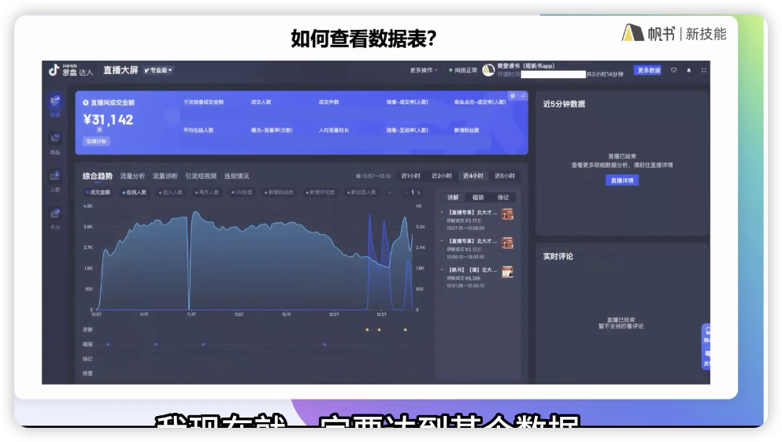
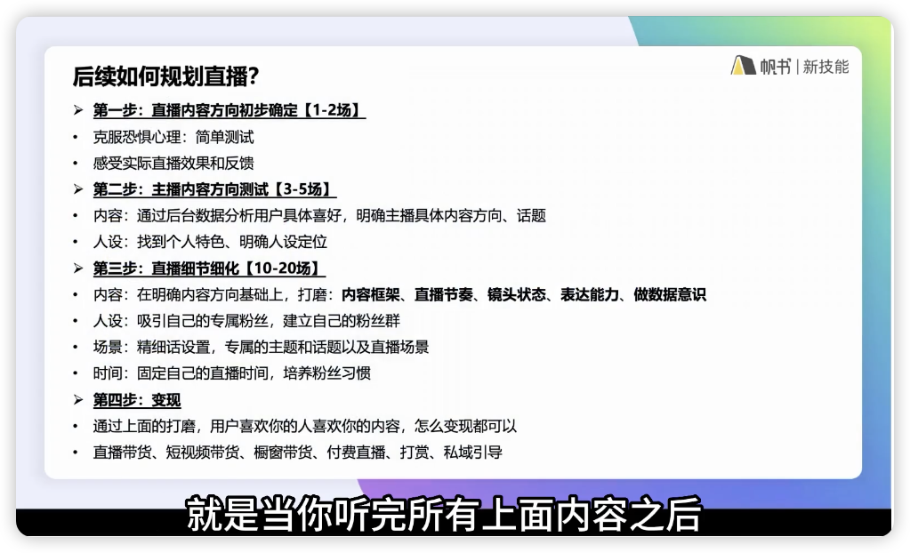
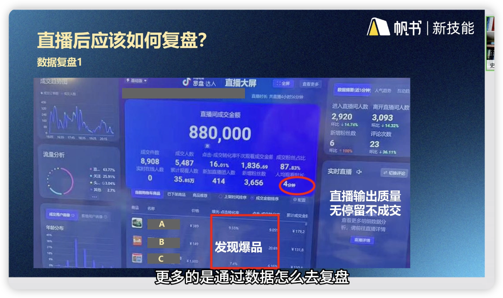
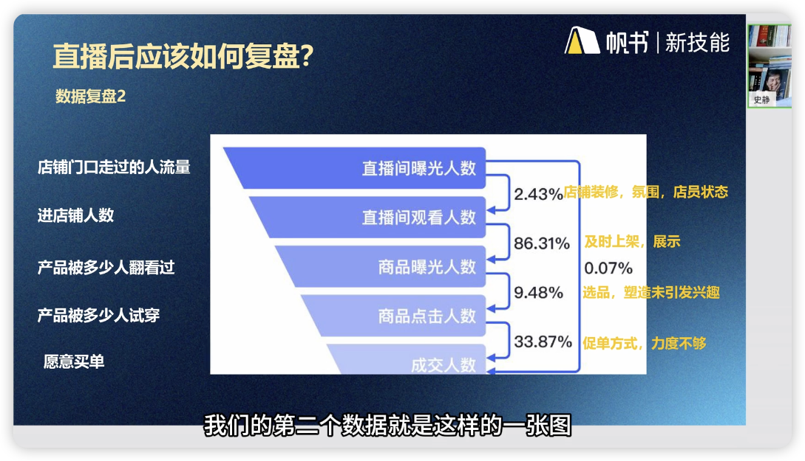

# 复盘——直播进步的不二法门
Date：2024.03.25
讲师：美美罗
---
<mark>场场有复盘，才能场场有进步！</mark>
快速进步，快速迭代的主播一定要做的动作就是复盘

## 1.新手复盘与迭代
改进和迭代不是凭空拍脑袋想出来的，是有数据作为支撑的。
数据长这样：

这个表可以在巨量百应当中看到，直播结束后自动生成
录屏来对应相应时间点的数据起伏背后的原因是什么？**这个地方值金子**

如深蓝色成交金额部分，你的成交数据好，平台推流量，流量曲线明显上升。这就验证了，你要么给平台带来用户停留，要么给平台带来现金收益；二者至少居其一。
进一步思考：为啥你的成交数据好？曲线中直线下降部分你做了什么？
余下的就不必说了吧！

人群画像：特征是什么，对应的策略是什么？
直播间搭建不是你自己的喜好，而是目标人群的喜好，如何推测这个喜欢？
微调、测试

后续如何规划直播？

粉丝群——私域引导
粉丝群是微信群吗？不是，是抖音平台自带功能，可引导到其他群组
主播开通过直播就可以在创作者中心中创建粉丝群。

新手需要按照图示顺序每一步仔细认真去做就好了

## 2.如何复盘
讲师：史静

录屏复盘：前期直播，强烈建议录屏回放，对照数据防止出现误判。
1. 复盘呈现力，画面、妆容、表现力（眼神、动作、情绪）
2. 找到订单激增的时间段，看自己做对了什么
3. 复盘要做好记录，下场优化建议，后续通过录屏/数据验证这次迭代的准确性

有时，应该反过来想，某个时间段数据不好，你做了什么？改正缺点可以提高你直播间的下限。发扬优点可以提升你直播间的上限。

## 3. 具体复盘操作

人均观看时长：4分钟是很好的数据了
爆品：20%的品占据了80%的利润/销售额，把优质资源向爆品倾斜。
直播数据不好的原因：个人状态、选品问题、时间段不对...

数据复盘2：

不好的数据：成交人数/直播间曝光人数=0.07%

这张图可以非常清晰的总结你的得失——行业平均数据是多少是判断标准
